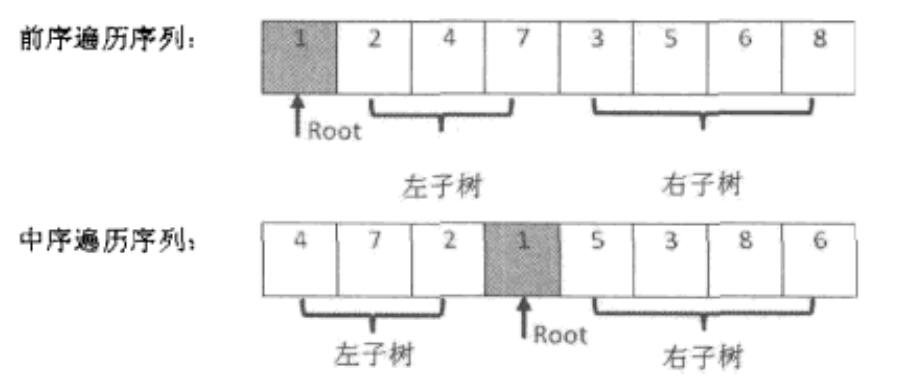

# 剑指Offer（四）：重建二叉树

> 搜索微信公众号:'AI-ming3526'或者'计算机视觉这件小事' 获取更多算法、机器学习干货  
> csdn：https://blog.csdn.net/baidu_31657889/  
> github：https://github.com/aimi-cn/AILearners

## 一、引子

这个系列是我在牛客网上刷《剑指Offer》的刷题笔记，旨在提升下自己的算法能力。  
查看完整的剑指Offer算法题解析请点击：[剑指Offer完整习题解析](https://blog.csdn.net/baidu_31657889/article/category/9059648)

## 二、题目

输入某二叉树的前序遍历和中序遍历的结果，请重建出该二叉树。假设输入的前序遍历和中序遍历的结果中都不含重复的数字。例如输入前序遍历序列{1,2,4,7,3,5,6,8}和中序遍历序列{4,7,2,1,5,3,8,6}，则重建二叉树并返回。

### 1、思路

通常树有如下几种遍历方式：

前序遍历：先访问根结点，再访问左子结点，最后访问右子结点。
中序遍历：先访问左子结点，再访问根结点，最后访问右子结点。
后序遍历：先访问左子结点，再访问右子结点，最后访问根结点。

先序遍历特点：第一个值是根节点
中序遍历特点：根节点左边都是左子树，右边都是右子树

思路：

首先根据根节点a将中序遍历划分为两部分，左边为左子树，右边为右子树
在左子树中根据第一条规则递归，得出左子树
在右子树中根据第一条规则递归，得出右子树
最后合成一棵树

使用递归思想

具体看图：




### 2、编程实现

**python2.7**

代码实现：

```python
# -*- coding:utf-8 -*-
# class TreeNode:
#     def __init__(self, x):
#         self.val = x
#         self.left = None
#         self.right = None
class Solution:
    # 返回构造的TreeNode根节点
    def reConstructBinaryTree(self, pre, tin):
        # write code here
        if len(pre) == 0:
            return None
        elif len(pre) == 1:
            return TreeNode(pre[0])
        else:
            root = TreeNode(pre[0])
            #找到root的index
            pos = tin.index(pre[0])
            root.left = self.reConstructBinaryTree(pre[1:pos+1],tin[:pos])
            root.right = self.reConstructBinaryTree(pre[pos+1:],tin[pos+1:])
        return root
```


