# 【2017cs231n】：课程笔记-第1讲：计算机视觉概述及历史背景

> 搜索微信公众号:'AI-ming3526'或者'计算机视觉这件小事' 获取更多算法、机器学习干货  
> csdn：https://blog.csdn.net/baidu_31657889/  
> github：https://github.com/aimi-cn/AILearners

## 课程简介

斯坦福CS231n(面向视觉识别的卷积神经网络)课程大家都很熟悉了，深度学习入门必备课程。  
这是一门每学期的视频更新都会引起一波尖叫的明星课。我参照的是2017版。

## 课程资源

课程地址：http://cs231n.stanford.edu/

[课程地址中文版-网易云课程](https://study.163.com/note/noteIndex.htm?id=1004697005&type=0)  

[课程地址中文版-b站](https://space.bilibili.com/216720985/channel/detail?cid=32406)  

[课程笔记github地址](https://github.com/aimi-cn/AILearners/tree/master/blog/dl/cs231n)

课程ppt地址：关注公众号“计算机视觉这件小事”或者“AI-ming3526” 回复关键字“cs231n”免费获取

## 课程作业

官方笔记作业地址：http://cs231n.github.io/

在写笔记的过程中 我会寻找一下19年或者18年的课程作业来做一下 可能会有用到pytorch和tensorflow可以顺便锻炼一下代码能力 

# section1 计算机视觉概述

什么是计算机视觉？

计算机视觉：针对视觉数据的研究。

在我们的世界中，就在过去的短短几年，视觉数据量爆炸式的增长到夸张的地步，这一点很大程度上得益于世界上许许多多的视觉传感器，大家都有智能手机，每个智能手机都有一个、两个、甚至3个摄像头，平均来说，世界上有比人更多的摄像头终端，并且由于所有的这些视觉传感器在这个世界上每天都产生有超级超级多的视觉数据。

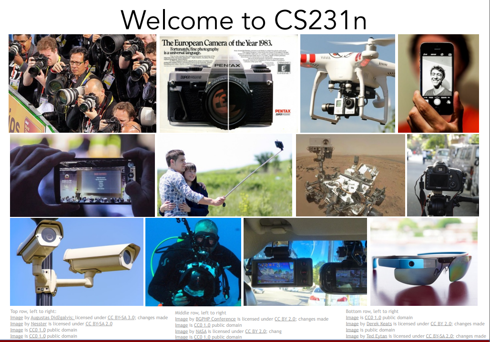

下面分享来自思科2015年的研究，预计到2017年，互联网上大约80%的流量都是视频，这甚至不像网络上所有的图像及其他类型的视觉数据，只是从一个纯粹的相位数的角度来看，大多数在互联网上传播的实际上是视觉数据，关键是如何用算法来开发可以利用和理解的数据，视觉数据存在的问题是它们很难理解，有时把视觉数据称为“互联网的暗物质”，它们构成了网络上传输的大部分数据。

根据YouTube的一个统计实例：大概每秒钟，有长达5小时的数据内容会被上传到YouTube，所以通过人工给每个视频标上注释、分类是非常困难甚至不可能的，计算机视觉是解决这种问题的重要技术，它能够对照片进行标签、分类，处理视频的每一帧。

我们当下数数五秒 就有15h的视频上传到youtubu上去了 这还是17年的数据 现在可能会更多

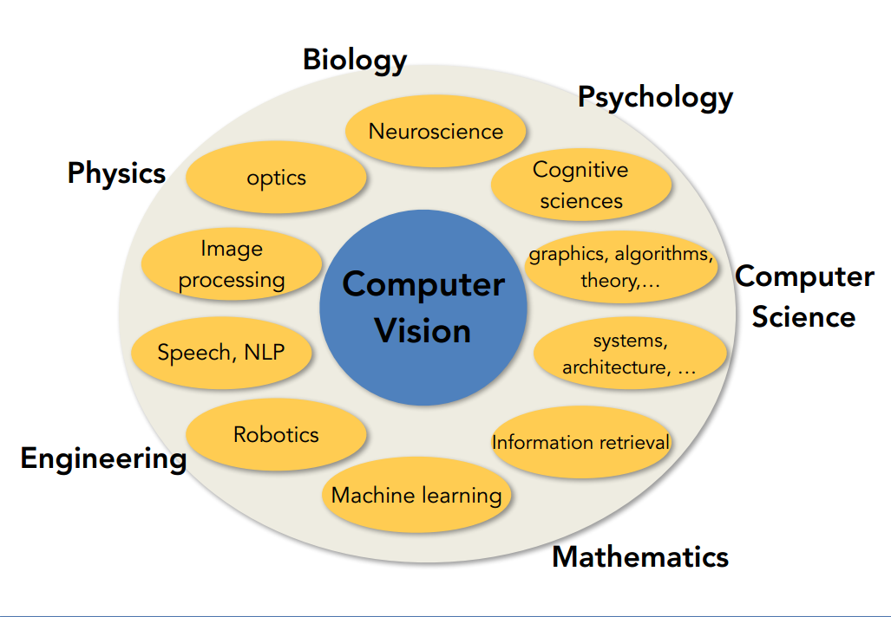

上图我们可以看出计算机视觉是一个与很多领域紧密关联的学科，它涉及到比如说工程、物理、生物等许多不同的领域(具体的内容看图)：

对于CS231n这门课程，它专注于一类特定的算法，围绕神经网络，特别是卷积神经网络，并将其应用于各种视觉识别任务。

# section2 计算机视觉历史背景

视觉的历史可以追溯到很久以前，动物拥有视觉的开端。公元前5.43亿年,这个时期被称为物种大爆炸，专家推测就是因为生物有了视觉系统。

如今，视觉成为了最重要的感知系统，人类的大脑皮层中有几乎一半的神经元与视觉有关，这项最重要的感知系统可以使人们生存、工作、运动等等，视觉对人们真的至关重要。

以上谈到了人类的视觉，那么人类让计算机获得视觉的历史又是怎么样的呢？

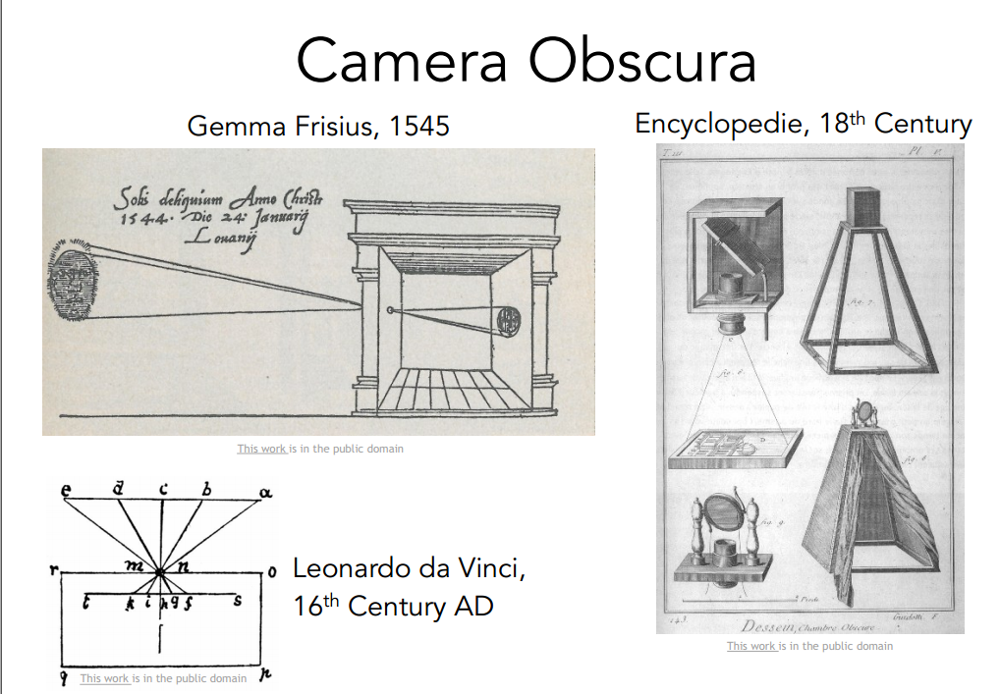

现在知道的最早的相机追溯到17世纪文艺复兴时期的暗箱，见上图，这是一种通过小孔成像的相机，这和动物早期的眼睛非常相似，通过小孔接收光线，后面的平板手机信息并且投影成像。

同时，生物学家开始研究视觉的机理，最具影响力并且启发了计算机视觉的一项研究是在五六十年代，休伯尔和威泽尔使用电生理学的研究，他们提出了“哺乳动物的视觉处理机制是怎样的”，通过观察何种刺激会引起视觉皮层神经的激烈反应，他们发现猫的大脑的初级视觉皮层有各种各样的细胞，其中最重要的是当它们朝着某个特定方向运动时，对面向边缘产生回应的细胞。见下图：

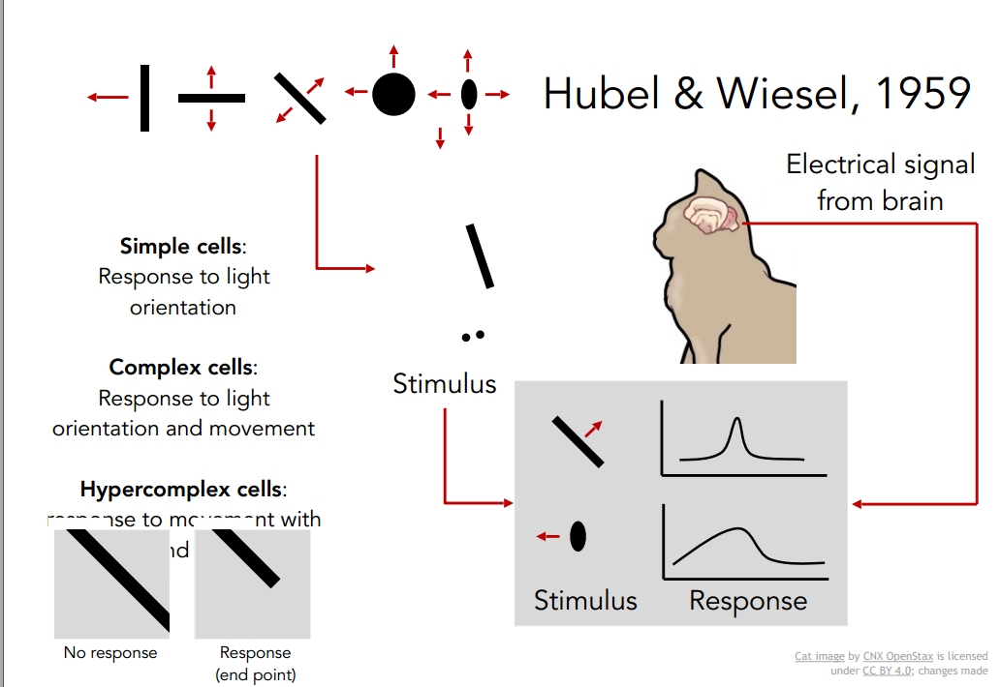

他们发现视觉处理是始于视觉世界的简单结构，面向边缘，沿着视觉处理的途径的移动信息也在变化，大脑建立了复杂的视觉信息，直到它可以识别更为复杂的视觉世界。

计算机视觉的历史是从60年代开始，从Larry Roberts的计算机视觉的第一篇博士论文开始。其中视觉世界被简化为简单的几何形状，目的是能够识别他们，重建这些形状是什么。

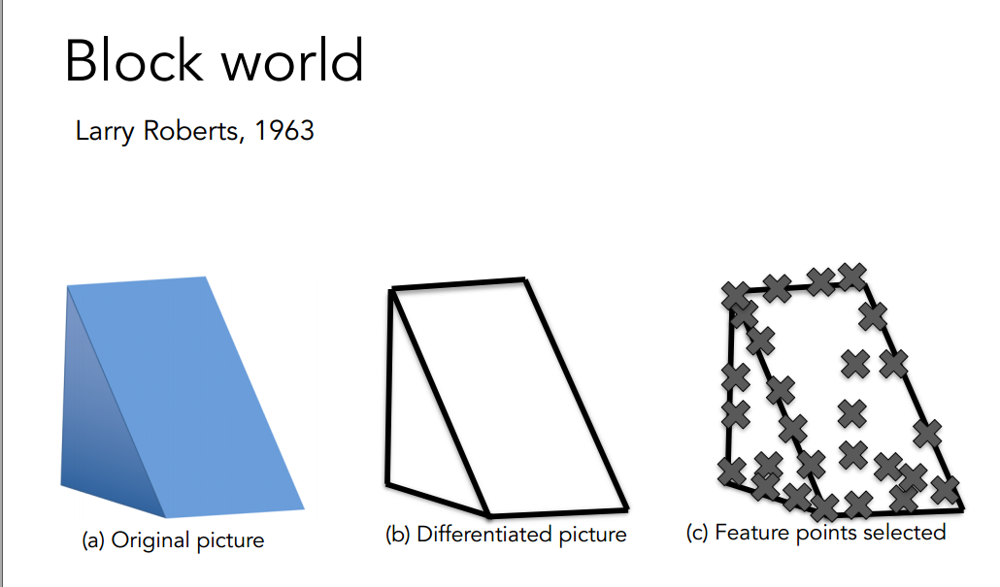

1966年，一个如今非常著名的MIT暑期项目“Summer Vision Project”，它试图有效的使用暑期工作时间来构建视觉系统的重要组成部分，五十年来，我们也没有弄清楚人类视觉的原理，但是计算机视觉领域已经从哪个夏季项目发展成为全球数千名研究人员的领域，并且仍然处理一些最根本的问题，这个领域已经成长为人工智能领域最重要和发展最快的领域之一。

70年代后期David Marr撰写的一本非常有影响力的书，内容包括了他是如何理解计算机视觉和应该如何开发可以使计算机识别世界的算法，他指出了为了拍摄一幅图像并获得视觉世界的最终全面3D表现必须经历的几个过程，如下图所示：

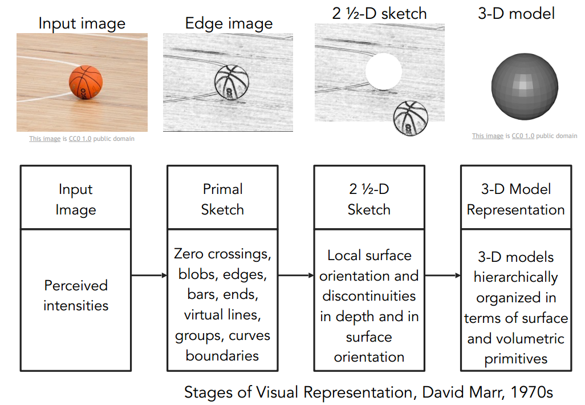

第一个过程就是他所说“原始草图”，大部分边缘、端点、虚拟线条、曲线、边界等都被用其他元素来表示。视觉处理的早期阶段有很多关于像边缘的简单结构，然后，边缘和曲线的下一步是2.5维草图，我们开始将表面深度信息、层或者视觉场景的不连续性拼凑在一起，然后将所有的内容放在一起，并在表面和体积图等分层组织了一个3d模型，这是一个非常理想化的思想过程，也是一个非常直观化的方式并考虑如何解构视觉信息。

70年代另一个重要的开创性问题：如何越过简单的块状世界并开始识别或表示现实世界的对象？

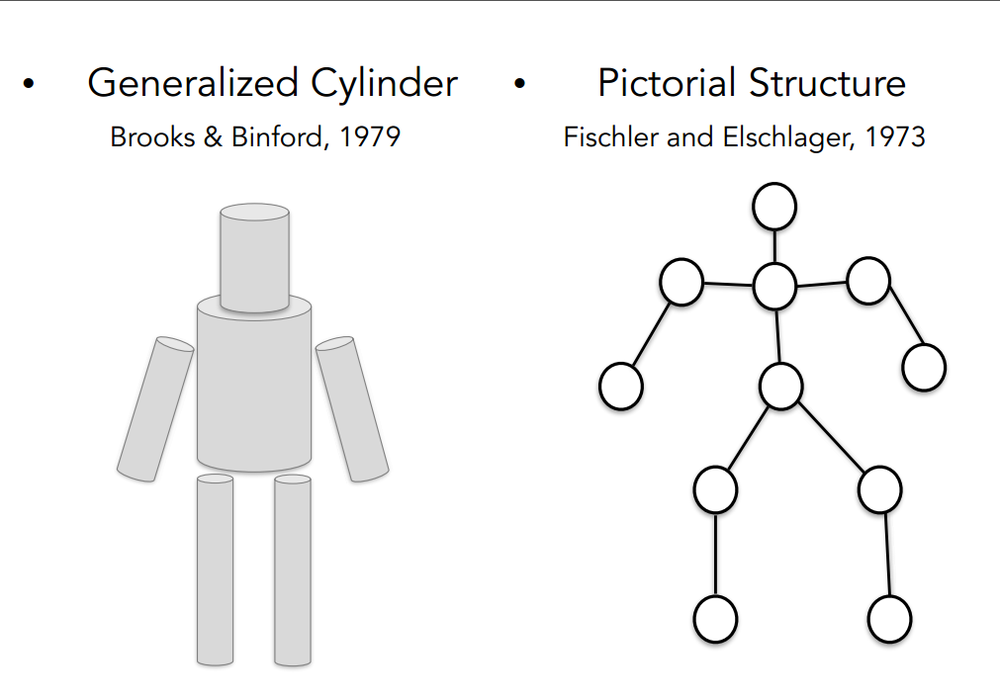

一个被称为“广义圆柱体”，一个被称为“图形结构”，他们的基本思想是每个对象都是由简单的几何图形单位组成，所以任何一种表示方法是将物体的复杂结构简约成一个集合体。例如一个人可以通过广义的圆柱形形状拼接在一起，或者人也可以由一些关键元素按照不同的间距组合在一起，所以任何一种表示方法是将物体的复杂结构简约成一个集合体，有更简单的形状和几何结构。

80年代David lowe思考的如何重建或识别由简单的物体结构组成的视觉空间，它尝试识别剃须刀，通过线和边缘进行构建，其中大部分是直线之间的组合。

从60年代到80年代，考虑的问题是计算机视觉的任务是什么，要解决物体识别的问题非常难。所以，当思考解决视觉问题过程中出现的问题时，另一个重要的问题产生：如果识别目标太难，我们首先要做的是目标分割。

这个任务就是把一张图片中的像素点归类到有意义的区域，可能不知道这些像素点组合到一起是一个人形，但可以把属于人的像素点从背景中抠出来，这个过程就叫作图像分割。

下面是Malik和Jianbo shi完成的用一个算法对图像进行分割：

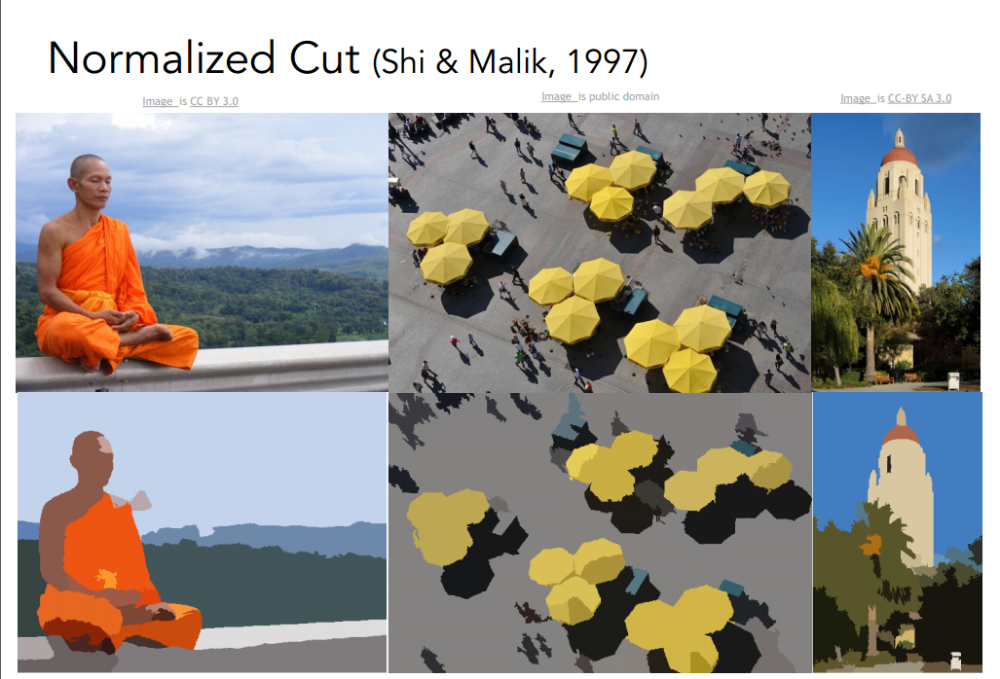

还有一个重要的研究是由Paul Viola和Michael Jones完成的，使用AdaBoost算法进行实时面部检测，在这个研究后不久推出了第一个能在数码相机中实现实时面部检测的数码相机，所以这是从基础科学研究到实际应用的一个快速转化。

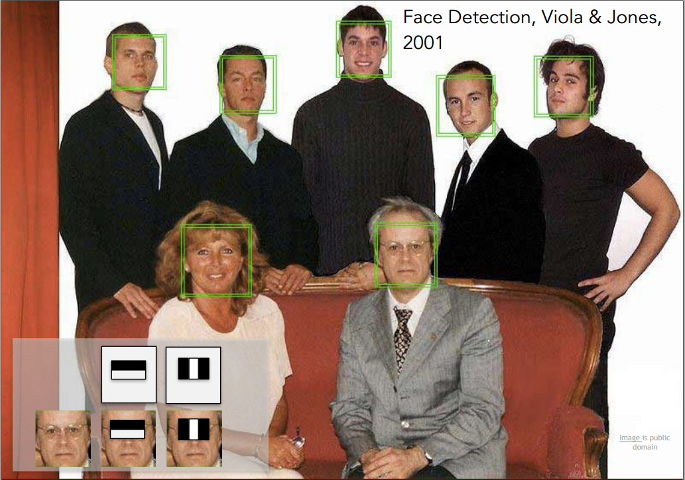

关于如何做到更好的目标识别，是可以继续研究的领域，所以在90年代末和21世纪的前几年，一个重要的思想方法就是基于特征的目标识别。由David Lowe完成的叫做SIFT特征，思路是匹配整个目标。

关于SIFT有兴趣的小伙伴可以移步这里看下视频介绍有代码：https://www.bilibili.com/video/av47799675

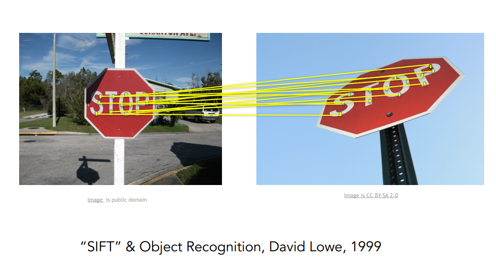

通过观察目标的某些部分、某些特征，它们往往能够在变化中具有表现性和不变性，所以目标识别的首要任务是在目标上确认这些关键的特征，然后把这些特征与相似的目标进行匹配，它比匹配整个目标要容易的多。例如，上图中一个stop标识中的SIFT特征与另一个stop标识中的SIFT特征相匹配。

这里有一个算法作为例子，叫做空间金字塔匹配，背后的思想是图片里面有各种特征，这些特征可以告诉我们这是哪种场景，到底是风景还是厨房，这个算法从图片的各部分，各像素抽取特征，并把他们放在一起，作为一个特征描述符，然后在特征描述符上做一个支持向量机。

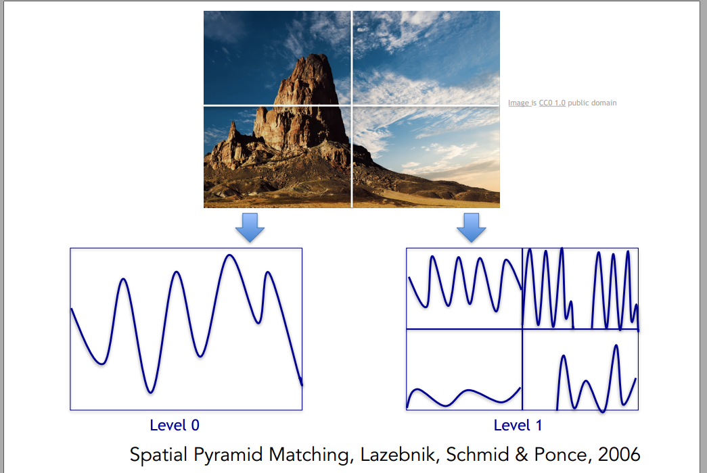

上图level0的意思是整张图的特征信息 level1被分为四部分 每部分的特征信息都不太一样 我们可以看到左下角那快的特征变化较小 因为它都是山所以变化较小 我们就可以根据这些特征来判断我们需要的信息。

有些工作是把这些特征放在一起以后，研究如何在实际图片中比较合理地设计人体姿态和辨认人体姿态，这方面一个工作被称为“方向梯度直方图”，另一个被称为“可变部件模型”。

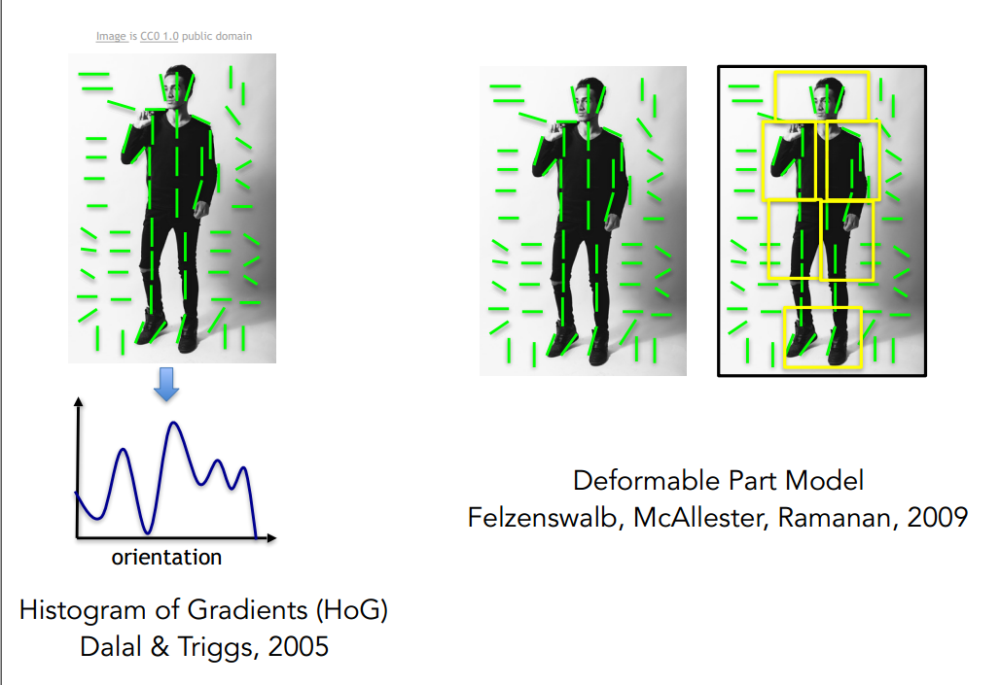

所以，从60年代、70年代、80年代一直到21世纪，图片的质量随着互联网的发展，计算机视觉领域也能拥有更好的数据了。直到21世纪早期，才开始真正拥有标注的数据集能够衡量在目标识别方面取得的成果，其实一个最著名的数据集叫做PASCAL Visual Challenge。这个数据集有20个类别，数据集的每个种类有成千上万张图片。

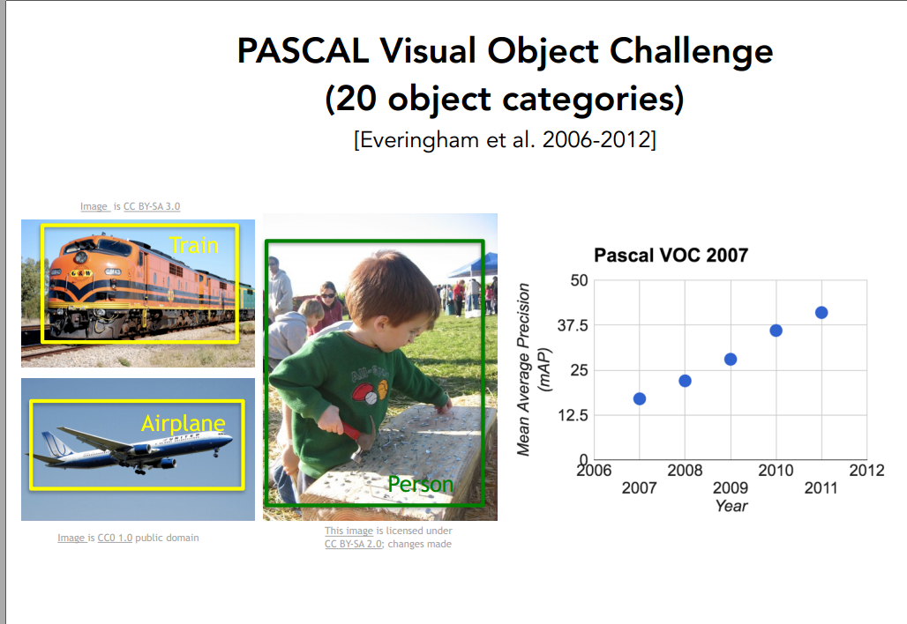

与此同时，提出了一个重要的问题：是否具备了识别真是世界中的每一个物体的能力或者说大部分物体。这个问题也是由机器学习中的一个现象驱动：大部分的机器学习算法，无论是图模型还是SVM、AdaBoost都可能会在训练过程中过拟合。因此，有这两方面的动力，一是单纯想识别自然界中的万物，二是要回归机器学习克服瓶颈—过拟合问题，开始开展了一个ImageNet的项目，汇集所有能找到的图片，组建一个尽可能大的数据集。

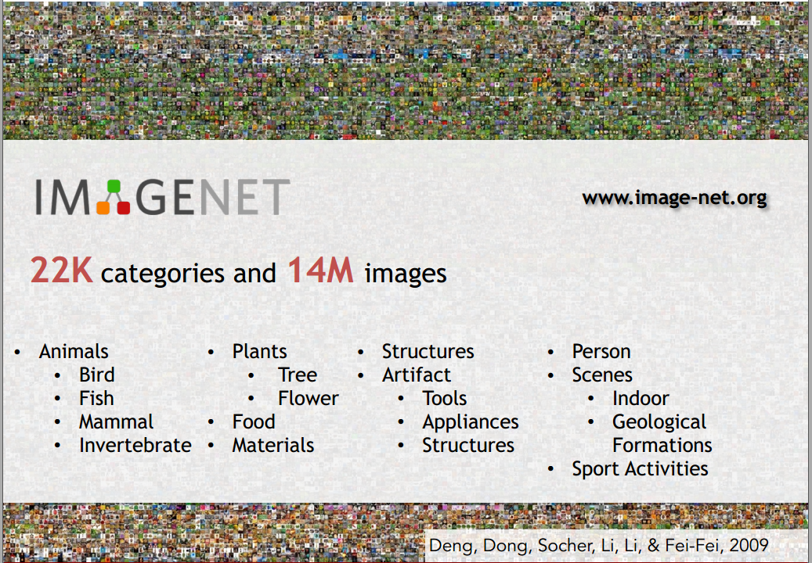

这是当时AI领域最大的数据集，将目标检测算法的发展推到了一个新的高度，尤其重要的是如何推动基准测试的进展。

下面是ImageNet挑战赛的从2010到2015的图像分类结果：

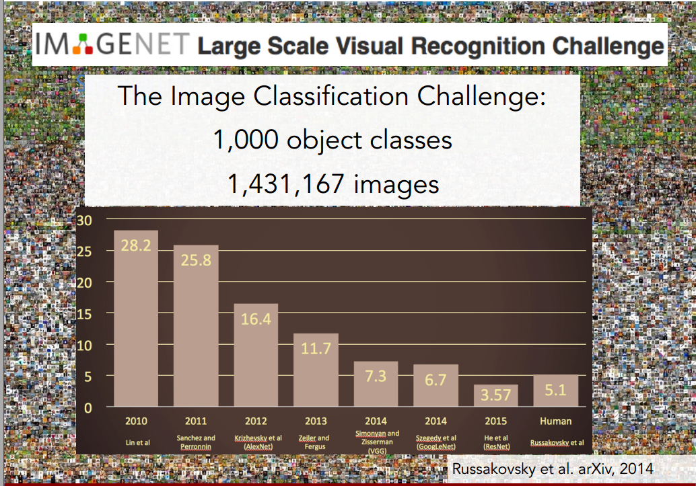

横轴表示年份，纵轴表示比赛结果的错误率，可以看到错误率正在稳步下降。可以看到图中2012的错误率下降的非常显著，低到和人类一样，这一年的算法是一种卷积神经网络模型，这也将是这门课程学习的重点，深入研究什么是卷积神经网络模型，也就是现在被熟知的深度学习。

# section3 CS321n课程介绍

CS321n将聚焦于视觉识别问题，第一个主要问题就是图像分类问题：让算法接收一张图作为输入，从固定的类别集合中选出该图像所属的类别。这个基本的分类器在很多地方都有不同的应用。

在CS231n课程中，将讨论一些其他的视觉识别问题，它们都建立在专门为图像分类而开发的各种工具之上，一些和图像分类的问题，比如目标检测或图像摘要生成。

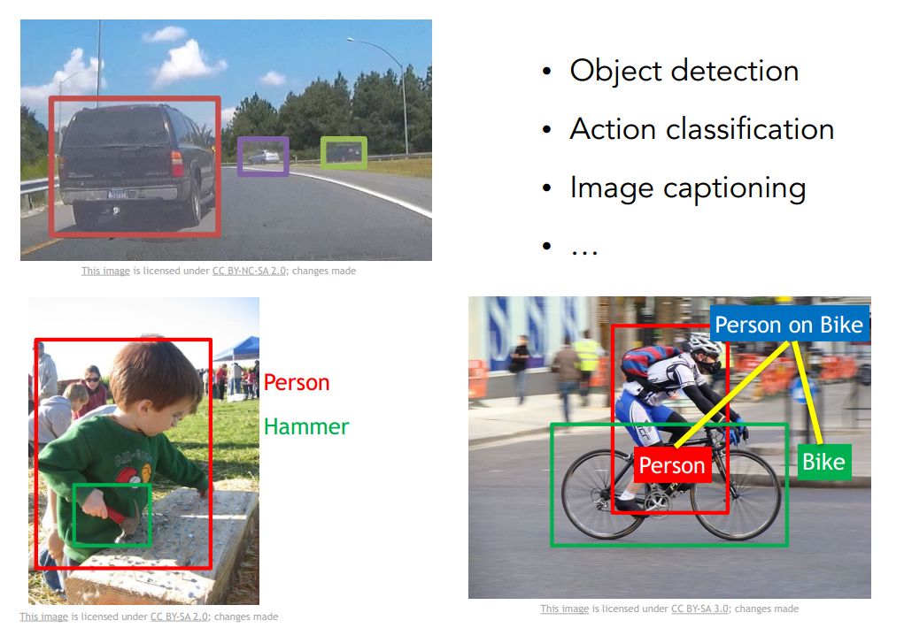

在目标检测中会有小小的区别，相比于识别出猫、狗等类别，我们还要画出边界框，标出东西在图像中的位置。图像摘要是当给到一幅图像，需要生成一段句子来描述这幅图像。

CNN，卷积神经网络只是深度学习架构的一种，但是它的成功是压倒性的，成为了目标识别的重要工具。回到ImageNet挑战赛中。

2011年提出的方法仍然是层次化的，它包含了很多分层，首先计算一些特征，然后计算局部不变特征，一些池化操作，在经过多层处理，最终将结果描述符传递给线性SVM,这里的结构仍然是层次结构，我们仍然检测边界，仍然有不变特征的概念，所有这些直觉信息都会在卷积神经网络中使用。但2012年才是真正的突破，Krizhevsky和他的导师提出了卷积神经网络，创造了7层卷积神经网络，并在2012年的比赛中夺得了冠军；而在这之前，一直都是特征+支持向量机的结构，一种分层结构；而在这之后，获得冠军的算法都是卷积神经网络。2015年vgg网络，那时有19层，到2015年更加疯狂，有一个残差网络(ResNets)，152层,从此以后性能得到一点提升，只要能将层数增加到200以上，不过也有可能造成Gpu内存溢出。

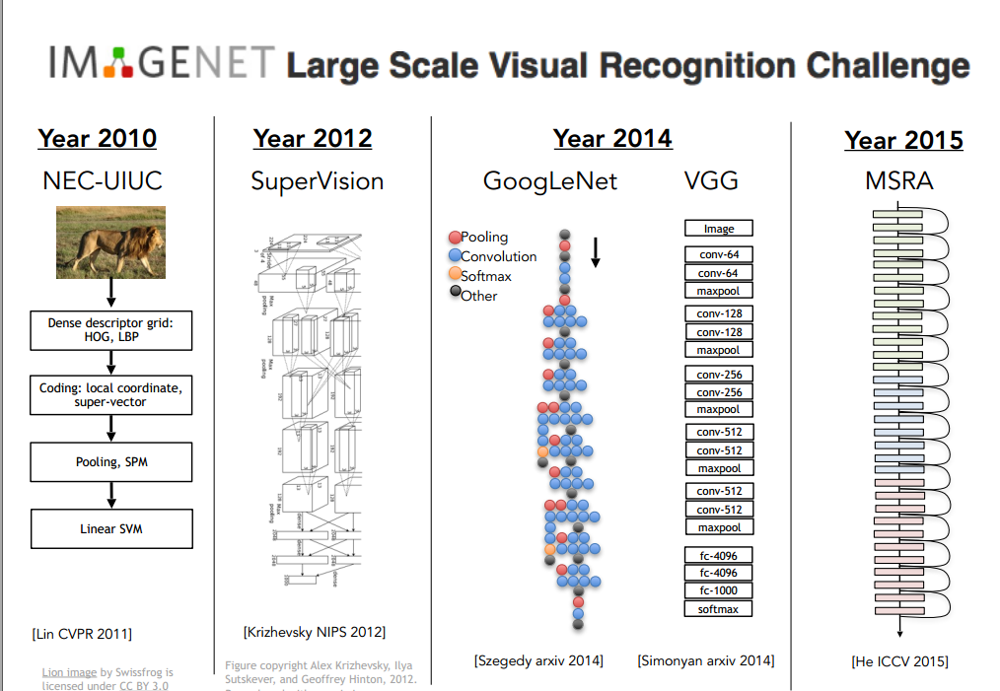

然而，卷积神经网络并不是一夜之间就成功的，事实上，这些算法可以追溯到更早的时候，与卷积神经网络有关的其中一项基础性工作是由Yann LeCun和他的伙伴于90年代完成的，1998年他们利用卷积神经网络进行数字识别。

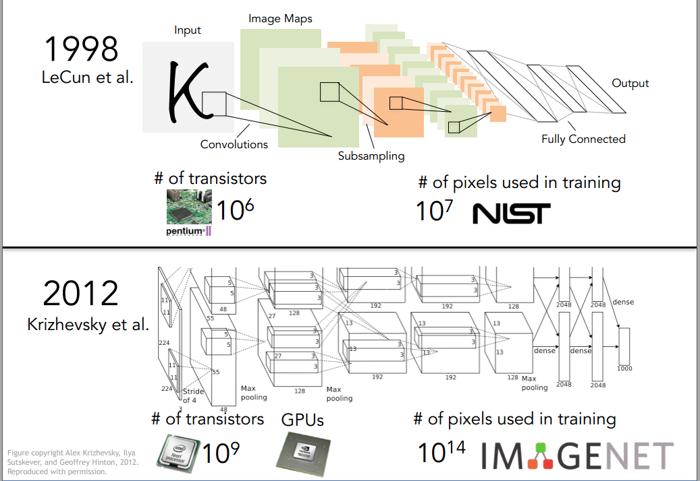

所以既然这些算法在90年代就很突出，为什么到最近几年才变得这么流行呢？从数学的角度来说，有很重要的两点引起了深度学习架构的复兴，一个是摩尔定律，计算能力在变得越来越高；如今有GPU这样的图像处理单元，其具有超高的并行计算能力，非常适合进行卷积神经网络模型这类高强度的计算，另一个是数据，算法需要大量的数据，需要给它们提供非常多的带标签的图像和像素，以便能最终取得更好的效果，有了大数据集，可以实现更强大的模型。

在计算机视觉领域，正尝试着制造一个拥有和人类一样视觉能力的机器，这样可以利用这些视觉系统可以实现很多惊奇的事情，但是当继续在该领域深入的时候，仍然有着大量的挑战和问题亟待解决，比如对整个照片进行密集标记、感知分组、使能够确定每个像素点的归属，这些仍是研究中的问题，所以需要持续不断地改进算法，从而做到更好。

例如动作识别，给一个含有一些人物的视频，什么才是识别其中人物活动的最好方式，这是一个很有挑战性的问题，随着继续发展，像增强现实或虚拟现实，并且随着新技术和新兴传感器的出现，将提出更附有挑战性的问题来解决。

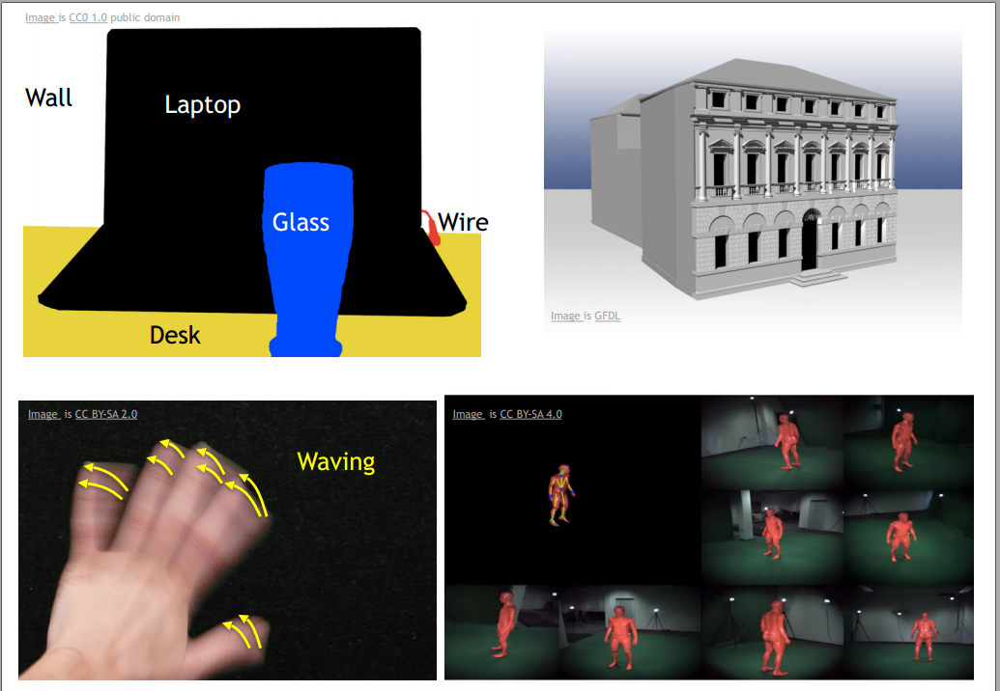

实验室有个数据集叫做视觉基因组，与简单的“在物体上贴标签”比起来，我们往往希望深入地理解图片中的人们在做什么、各个物体之间的关系是什么，于是我们开始探究物体之间的联系，这是一个被称为视觉基因组的项目。在显示生活中捕捉错综复杂的事，而不仅仅是框定出物体，我们应该描述出图像，作为整个大图像语义相关的概念，而不仅包括对象的身份，还包括对象关系，对象属性，以及场景中发生的动作，这种表达可能允许我们使用简单分类去捕捉一些丰富的视觉世界中唾手可得的事情，这绝不是一种标准的方法。

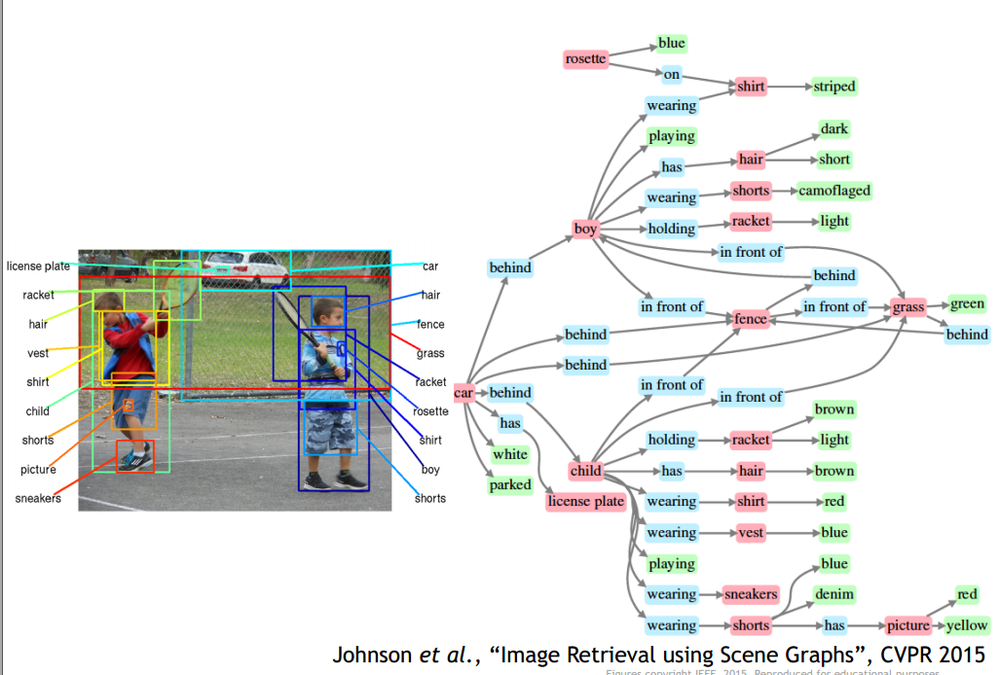

计算机视觉领域的一个愿景即是“看图说故事”，人类的生物视觉系统是非常强大的，看到一张图片，就能够描述图片的内容，并且只需不到一秒种的时间，如果能够让计算机也能做的同样的事情，那毋庸置疑是一项重大的突破；如果要实现真实深刻的图像理解，如今的计算机视觉算法仍然有很长的路要走。

计算机视觉能让世界变得更加美好，它还可以被应用到类似医学诊断、自动驾驶、机器人或者和这些完全版不同的领域。

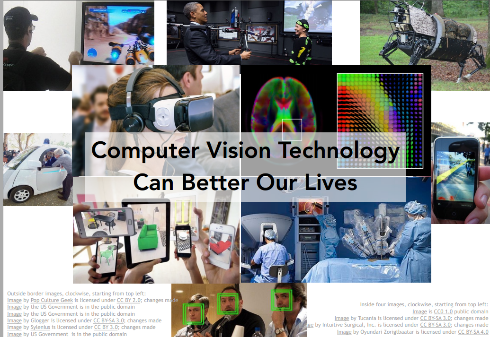

参照：https://blog.csdn.net/hawkl123/article/details/83011465