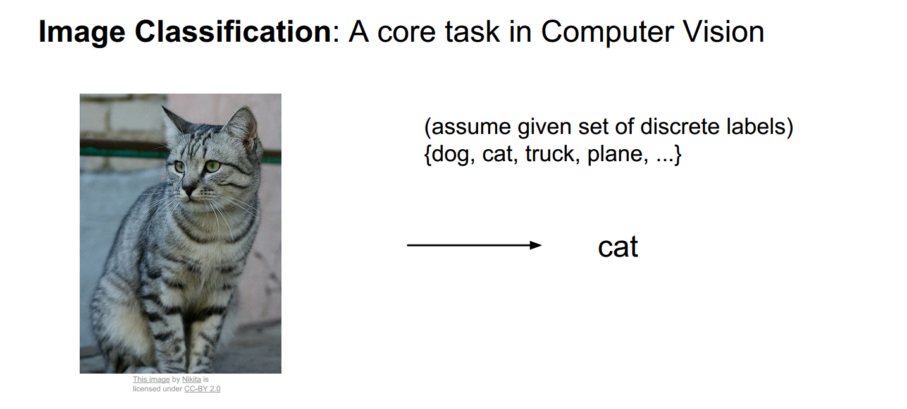
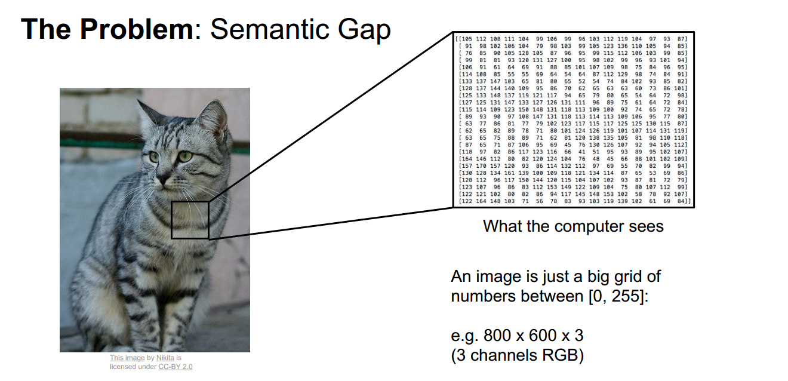
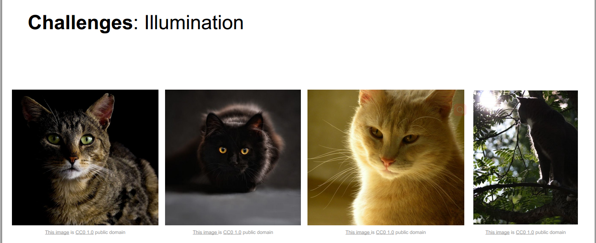
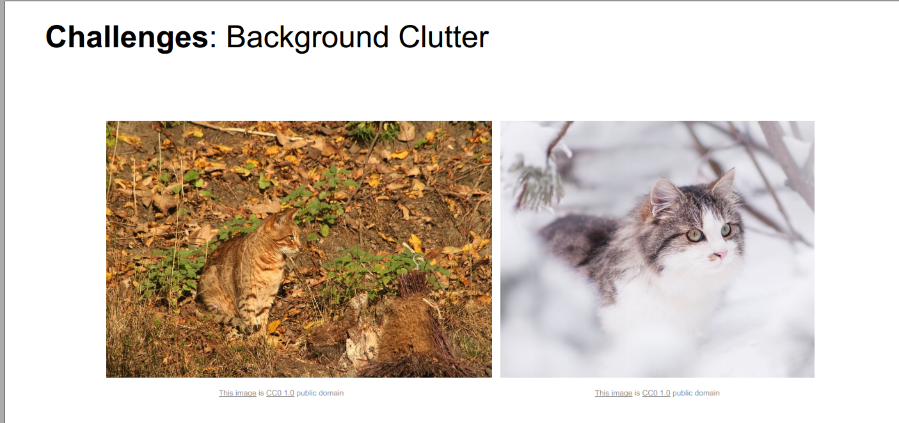
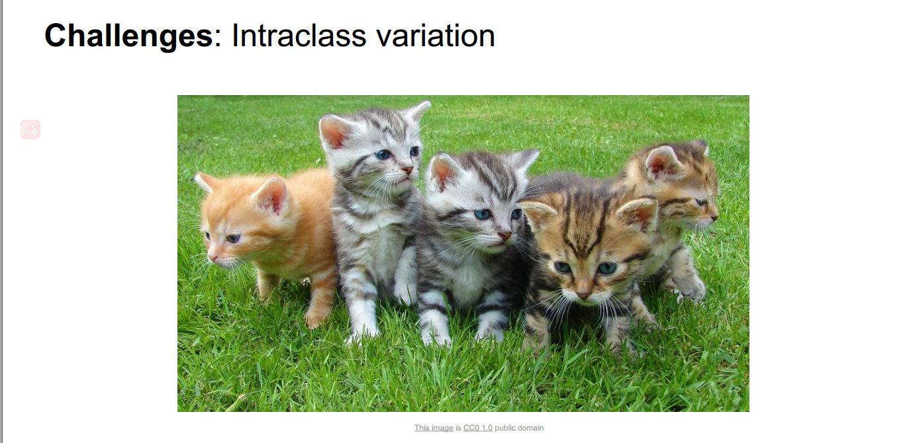
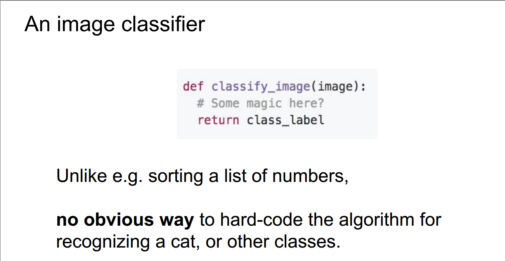
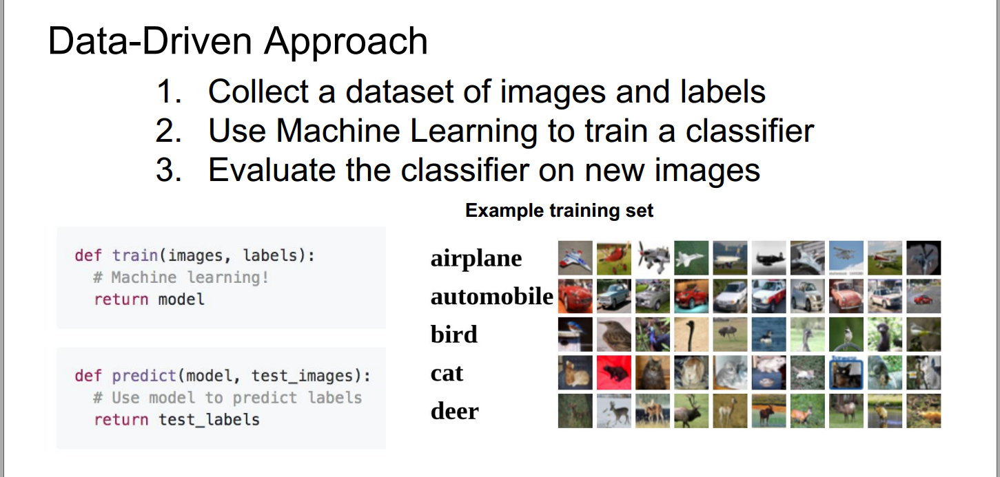
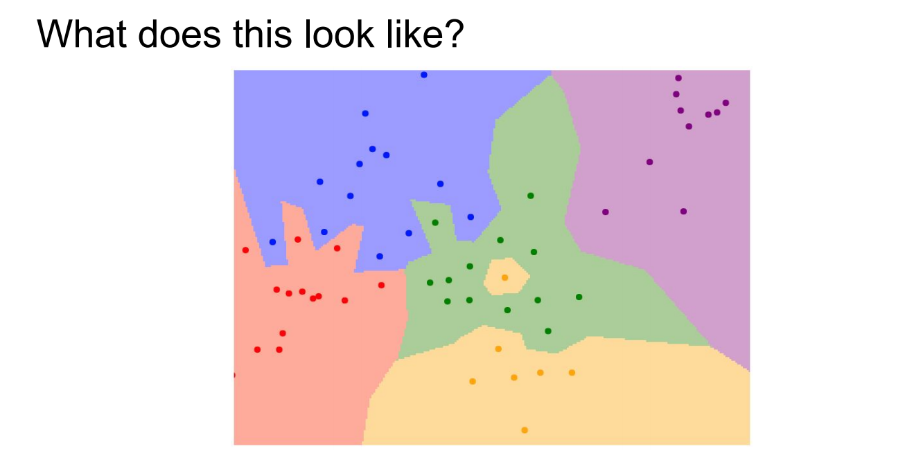
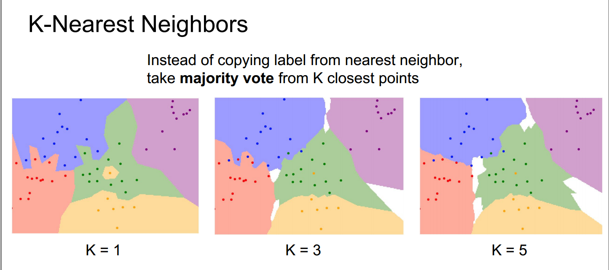

# 【2017cs231n】：课程笔记-第2讲：图像分类

> 搜索微信公众号:'AI-ming3526'或者'计算机视觉这件小事' 获取更多算法、机器学习干货  
> csdn：https://blog.csdn.net/baidu_31657889/  
> github：https://github.com/aimi-cn/AILearners

## 课程简介

斯坦福CS231n(面向视觉识别的卷积神经网络)课程大家都很熟悉了，深度学习入门必备课程。  
这是一门每学期的视频更新都会引起一波尖叫的明星课。我参照的是2017版。

## 课程资源

课程地址：http://cs231n.stanford.edu/

[课程地址中文版-网易云课程](https://study.163.com/note/noteIndex.htm?id=1004697005&type=0)  

[课程地址中文版-b站](https://space.bilibili.com/216720985/channel/detail?cid=32406)  

[课程笔记github地址](https://github.com/aimi-cn/AILearners/tree/master/blog/dl/cs231n)

课程ppt地址：关注公众号“计算机视觉这件小事”或者“AI-ming3526” 回复关键字“cs231n”免费获取

## 课程作业

官方笔记作业地址：http://cs231n.github.io/

在写笔记的过程中 我会寻找一下19年或者18年的课程作业来做一下 可能会有用到pytorch和tensorflow可以顺便锻炼一下代码能力 

# section2.1 数据驱动方法

在上一讲，提到了关于图像分类的任务，这是一个计算机视觉中真正核心的任务，同时也是本课程中关注的重点。

当做图像分类时，分类系统接收一些输入图像，并且系统已经清楚了一些已经确定了分类或者标签的集合，标签可能是猫、狗、汽车以及一些固定的类别标签集合等等；计算机的工作就是观察图片并且给它分配其中一些固定的分类标签。对于人来说这是非常简单的事情，但对计算机来说，却是非常困难的事情。

当一个计算机看这些图片的时候，他看到的是什么那，他肯定没有一直猫咪的整个概念，而不像我们看到的一样，计算机图片的方式其实就是一大堆数字。所以图像大小(如上图)可能是宽600像素，高800像素，有3个颜色通道，分别是红、绿和蓝（简称RGB）。如此，该图像就包含了600X800X3=1440000个数字，每个数字都是在范围0-255之间的整型，其中0表示全黑，255表示全白。我们的任务就是把这些上百万的数字变成一个简单的标签，比如“猫”。

所以，对计算机来说，这就是一个巨大的数字阵列，很难从中提取出猫咪的特征，我们把这个问题称为“语义鸿沟”。对于猫咪的概念或者它的标签，是我们赋予图像的一个语义标签，而猫咪的语义标签和计算机实际看到的像素值之间有很大的差距。

困难和挑战：对于人来说，识别出一个像“猫”一样视觉概念是简单至极的，然而从计算机视觉算法的角度来看就值得深思了。我们在下面列举了计算机视觉算法在图像识别方面遇到的一些困难，要记住图像是以3维数组来表示的，数组中的元素是亮度值。

- 视角变化：同一个物体，摄像机可以从多个角度来展现。
- 大小变化：物体可视的大小通常是会变化的（不仅是在图片中，在真实世界中大小也是变化的）。
- 形变：很多东西的形状并非一成不变，会有很大变化。
- 遮挡：目标物体可能被挡住。有时候只有物体的一小部分（可以小到几个像素）是可见的。
- 光照条件：在像素层面上，光照的影响非常大。
- 背景干扰：物体可能混入背景之中，使之难以被辨认。
- 类内差异：一类物体的个体之间的外形差异很大，比如椅子。这一类物体有许多不同的对象，每个都有自己的外形。

面对以上所有变化及其组合，好的图像分类模型能够在维持分类结论稳定的同时，保持对类间差异足够敏感。

如果使用python写一个图像分类器，定义一个方法，接受图片作为输入参数，来一波神操作，最终返回到图片上进行标记是猫还是狗等等。但是并什么简单明了的算法可以直接完成这些识别，所以图像识别算法很难。

对于猫来说，它有耳朵、眼睛、鼻子、嘴巴，而通过上一章中Hubel和Wiesel的研究，我们了解到边缘对于视觉识别是十分重要的，所以尝试计算出图像的边缘，然后把边、角各种形状分类好，可以写一些规则来识别这些猫。

但是如果想识别比如卡车、其他动物等，又需要重新从头再来一遍，所以这不是一种可推演的方法，我们需要的是一种识别算法可以拓展到识别世界上各种对象，由此我们想到了一种数据驱动的方法。

 我们并不需要具体的分类规则来识别一只猫或鱼等其他的对象，取而代之的方法是：

    （1）首先收集不同类别图片的示例图，制作成带有标签的图像数据集；

    （2）然后用机器学习的方法来训练一个分类器；

    （3）最后用这个分类器来识别新的图片，看是否能够识别。

所以，如果写一个方法，可以定义两个函数，一个是训练函数，用来接收图片和标签，然后输出模型；另一个数预测函数，接收一个模型，对图片种类进行预测。

这种数据驱动类的算法是比深度学习更广义的一种理念，通过这种过程，最简单的分类器（最近邻分类器），在训练过程中，我们只是单纯的记录所有的训练数据；在预测过程中，拿新的图像与已训练好的训练对比，进行预测。

图像分类数据集：[CIFAR-10](http://www.cs.toronto.edu/~kriz/cifar.html)。一个非常流行的图像分类数据集是CIFAR-10。这个数据集包含了60000张32X32的小图像。每张图像都有10种分类标签中的一种。这60000张图像被分为包含50000张图像的训练集和包含10000张图像的测试集。在下图左侧中你可以看见10个类的10张随机图片。

左边：从CIFAR-10数据库来的样本图像。右边：第一列是测试图像，然后第一列的每个测试图像右边是使用Nearest Neighbor算法，根据像素差异，从训练集中选出的10张最类似的图片。

我们需要知道一个细节问题：给定两幅图片，该怎么对它们进行比较？

如果将测试图片和所有训练图片进行比较，将有很多不同的选择来确定需要什么样的比较函数。我们可以使用L1距离（有时称为曼哈顿距离），这是一个简单的比较图片的方法，只是对这些图片中的单个像素进行比较：

测试和训练两张图片使用L1距离来进行比较。图像逐个像素求差值，然后将所有差值加起来得到一个数值。如果两张图片一模一样，那么L1距离为0，但是如果两张图片很是不同，那L1值将会非常大。

虽然这个方法有些笨，但是有些时候却有它的合理性，它给出了比较两幅图片的具体方法。

下面是最近邻分类器的python代码

但是最近邻算法会出现下面的问题，如果我们在训练集中有N个实例，训练和测试的过程时间复杂度的情况那，答案是训练：O(1)  测试：O(N)，由此看来最近邻算法有点落后了，它在训练中花的时间很少，而在测试中花了大量时间；而看卷积神经网络和其他参数模型，则正好相反，它们会花很多时间在训练上，而在测试过程中则非常快。我们希望的是测试能够更快一点，而训练慢一点没有关系，它是在数据中心完成的。

那么在实际应用中，最近邻算法到底表现如何?可以看到下面的图像：

它是最近邻分类器的决策区域，训练集包含二维平面中的这些点，点的颜色代表不同的类别或不同的标签，这里有五种类型的点。对于这些点来说，将计算这些训练数据中最近的实例，然后在这些点的背景上着色，标示出它的类标签，可以发现最近邻分类器是根据相邻的点来切割空间并进行着色。

但是通过上述图片中，可以看到绿色区域中间的黄色区域（事实上该点应该是绿色的），蓝色区域中有绿色区域的一部分，这些都说明了最近邻分类器的处理是有问题的。

那么，基于以上问题，产生了K-近邻算法，它不仅是寻找最近的点，还会做一些特殊的操作，根据距离度量，找到最近的K个点，然后在这些相邻点中进行投票，票数多的近邻点预测出结果。

下面用同样的数据集分别使用K=1、K=3、K=5的最近邻分类器：

在K=3时，可以看到绿色区域中的黄色点不再会导致周围的区域被划分成黄色，因为使用了多数投票，中间的这个绿色区域都会被划分成绿色；在K=5时，可以看到蓝色和红色区域间的决策边界变得更加平滑好看。

所以使用最近邻分类器时，总会给K赋一个比较大的值，这会是决策边界变得更加平滑，从而得到更好的结果。当然这个值也不能太大，要在你测试或者训练样本的大小上调整。

之前写过的一个机器学习实战的k-近邻算法例子-识别手写数字：https://blog.csdn.net/baidu_31657889/article/details/89095213

学生提问：上图中白色区域代表什么？

答：白色区域表示这个区域没有获得K-最近邻的投票，可以做大胆的假设，把它划分为一个不同的类别。

# section2.2 K-近邻算法

# section2.3 线性分类

