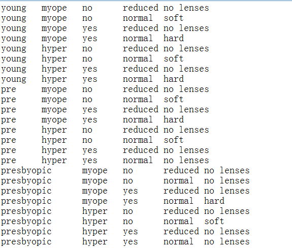

# 《机器学习实战》3.4决策树项目案例04：使用Sklearn预测隐形眼镜类型
> 搜索微信公众号:'AI-ming3526'或者'计算机视觉这件小事' 获取更多人工智能、机器学习干货  
> csdn：https://blog.csdn.net/baidu_31657889/  
> github：https://github.com/aimi-cn/AILearners

## 1、实战背景

进入本文的正题：眼科医生是如何判断患者需要佩戴隐形眼镜的类型的？一旦理解了决策树的工作原理，我们甚至也可以帮助人们判断需要佩戴的镜片类型。
隐形眼镜数据集是非常著名的数据集，它包含很多换着眼部状态的观察条件以及医生推荐的隐形眼镜类型。隐形眼镜类型包括硬材质(hard)、软材质(soft)以及不适合佩戴隐形眼镜(no lenses)。数据来源与UCI数据库，数据集下载地址：[数据集下载](https://github.com/aimi-cn/AILearners/blob/master/data/sourceData/Ch03/lenses.txt)

数据集信息： 
* 特征有四个：age（年龄）、prescript（症状）、astigmatic（是否散光）、tearRate（眼泪数量） 
* 隐形眼镜类别有三类(最后一列)：硬材质(hard)、软材质(soft)、不适合佩戴隐形眼镜(no lenses) 


可以使用已经写好的Python程序构建决策树(上节已经给出实现步骤)，不过出于继续学习的目的，本文使用Sklearn实现。

## 2、使用Sklearn构建决策树
官方英文文档地址：http://scikit-learn.org/stable/modules/generated/sklearn.tree.DecisionTreeClassifier.html
sklearn.tree模块提供了决策树模型，用于解决分类问题和回归问题。方法如下图所示：

本次实战内容使用的是DecisionTreeClassifier和export_graphviz，前者用于决策树构建，后者用于决策树可视化。

DecisionTreeClassifier构建决策树：

让我们先看下DecisionTreeClassifier这个函数，一共有12个参数：

参数说明如下：

- criterion：特征选择标准，可选参数，默认是gini，可以设置为entropy。gini是基尼不纯度，是将来自集合的某种结果随机应用于某一数据项的预期误差率，是一种基于统计的思想。entropy是香农熵，也就是上篇文章讲过的内容，是一种基于信息论的思想。Sklearn把gini设为默认参数，应该也是做了相应的斟酌的，精度也许更高些？ID3算法使用的是entropy，CART算法使用的则是gini。
- splitter：特征划分点选择标准，可选参数，默认是best，可以设置为random。每个结点的选择策略。best参数是根据算法选择最佳的切分特征，例如gini、entropy。random随机的在部分划分点中找局部最优的划分点。默认的"best"适合样本量不大的时候，而如果样本数据量非常大，此时决策树构建推荐"random"。
- max_features：划分时考虑的最大特征数，可选参数，默认是None。寻找最佳切分时考虑的最大特征数(n_features为总共的特征数)，有如下6种情况：

    - 如果max_features是整型的数，则考虑max_features个特征；
如果max_features是浮点型的数，则考虑int(max_features * n_features)个特征；
    - 如果max_features设为auto，那么max_features = sqrt(n_features)；
    - 如果max_features设为sqrt，那么max_featrues = sqrt(n_features)，跟auto一样；
    - 如果max_features设为log2，那么max_features = log2(n_features)；
    - 如果max_features设为None，那么max_features = n_features，也就是所有特征都用。
    - 一般来说，如果样本特征数不多，比如小于50，我们用默认的"None"就可以了，如果特征数非常多，我们可以灵活使用刚才描述的其他取值来控制划分时考虑的最大特征数，以控制决策树的生成时间。

- max_depth：决策树最大深，可选参数，默认是None。这个参数是这是树的层数的。层数的概念就是，比如在贷款的例子中，决策树的层数是2层。如果这个参数设置为None，那么决策树在建立子树的时候不会限制子树的深度。一般来说，数据少或者特征少的时候可以不管这个值。或者如果设置了min_samples_slipt参数，那么直到少于min_smaples_split个样本为止。如果模型样本量多，特征也多的情况下，推荐限制这个最大深度，具体的取值取决于数据的分布。常用的可以取值10-100之间。
- min_samples_split：内部节点再划分所需最小样本数，可选参数，默认是2。这个值限制了子树继续划分的条件。如果min_samples_split为整数，那么在切分内部结点的时候，min_samples_split作为最小的样本数，也就是说，如果样本已经少于min_samples_split个样本，则停止继续切分。如果min_samples_split为浮点数，那么min_samples_split就是一个百分比，ceil(min_samples_split * n_samples)，数是向上取整的。如果样本量不大，不需要管这个值。如果样本量数量级非常大，则推荐增大这个值。
- min_samples_leaf：叶子节点最少样本数，可选参数，默认是1。这个值限制了叶子节点最少的样本数，如果某叶子节点数目小于样本数，则会和兄弟节点一起被剪枝。叶结点需要最少的样本数，也就是最后到叶结点，需要多少个样本才能算一个叶结点。如果设置为1，哪怕这个类别只有1个样本，决策树也会构建出来。如果min_samples_leaf是整数，那么min_samples_leaf作为最小的样本数。如果是浮点数，那么min_samples_leaf就是一个百分比，同上，celi(min_samples_leaf * n_samples)，数是向上取整的。如果样本量不大，不需要管这个值。如果样本量数量级非常大，则推荐增大这个值。
- min_weight_fraction_leaf：叶子节点最小的样本权重和，可选参数，默认是0。这个值限制了叶子节点所有样本权重和的最小值，如果小于这个值，则会和兄弟节点一起被剪枝。一般来说，如果我们有较多样本有缺失值，或者分类树样本的分布类别偏差很大，就会引入样本权重，这时我们就要注意这个值了。
- max_leaf_nodes：最大叶子节点数，可选参数，默认是None。通过限制最大叶子节点数，可以防止过拟合。如果加了限制，算法会建立在最大叶子节点数内最优的决策树。如果特征不多，可以不考虑这个值，但是如果特征分成多的话，可以加以限制，具体的值可以通过交叉验证得到。
- class_weight：类别权重，可选参数，默认是None，也可以字典、字典列表、balanced。指定样本各类别的的权重，主要是为了防止训练集某些类别的样本过多，导致训练的决策树过于偏向这些类别。类别的权重可以通过{class_label：weight}这样的格式给出，这里可以自己指定各个样本的权重，或者用balanced，如果使用balanced，则算法会自己计算权重，样本量少的类别所对应的样本权重会高。当然，如果你的样本类别分布没有明显的偏倚，则可以不管这个参数，选择默认的None。
- random_state：可选参数，默认是None。随机数种子。如果是证书，那么random_state会作为随机数生成器的随机数种子。随机数种子，如果没有设置随机数，随机出来的数与当前系统时间有关，每个时刻都是不同的。如果设置了随机数种子，那么相同随机数种子，不同时刻产生的随机数也是相同的。如果是RandomState instance，那么random_state是随机数生成器。如果为None，则随机数生成器使用np.random。
- min_impurity_split：节点划分最小不纯度,可选参数，默认是1e-7。这是个阈值，这个值限制了决策树的增长，如果某节点的不纯度(基尼系数，信息增益，均方差，绝对差)小于这个阈值，则该节点不再生成子节点。即为叶子节点 。
- presort：数据是否预排序，可选参数，默认为False，这个值是布尔值，默认是False不排序。一般来说，如果样本量少或者限制了一个深度很小的决策树，设置为true可以让划分点选择更加快，决策树建立的更加快。如果样本量太大的话，反而没有什么好处。问题是样本量少的时候，我速度本来就不慢。所以这个值一般懒得理它就可以了。

除了这些参数要注意以外，其他在调参时的注意点有：

- 当样本数量少但是样本特征非常多的时候，决策树很容易过拟合，一般来说，样本数比特征数多一些会比较容易建立健壮的模型
- 如果样本数量少但是样本特征非常多，在拟合决策树模型前，推荐先做维度规约，比如主成分分析（PCA），特征选择（Losso）或者独立成分分析（ICA）。这样特征的维度会大大减小。再来拟合决策树模型效果会好。
- 推荐多用决策树的可视化，同时先限制决策树的深度，这样可以先观察下生成的决策树里数据的初步拟合情况，然后再决定是否要增加深度。
- 在训练模型时，注意观察样本的类别情况（主要指分类树），如果类别分布非常不均匀，就要考虑用class_weight来限制模型过于偏向样本多的类别。
- 决策树的数组使用的是numpy的float32类型，如果训练数据不是这样的格式，算法会先做copy再运行。
- 如果输入的样本矩阵是稀疏的，推荐在拟合前调用csc_matrix稀疏化，在预测前调用csr_matrix稀疏化。

sklearn.tree.DecisionTreeClassifier()提供了一些方法供我们使用，如下图所示：


了解到这些，我们就可以编写代码了。

```python
from sklearn import tree

if __name__ == '__main__':
    fr = open('C:/Users/Administrator/Desktop/blog/github/AILearners/data/sourceData/Ch03/lenses.txt')
    #解析tab键分隔的数据行
    lenses = [inst.strip().split('\t') for inst in fr.readlines()]
    print(lenses)
    lensesLabels = ['age', 'prescript', 'astigmatic', 'tearRate']
    clf = tree.DecisionTreeClassifier()
    lenses = clf.fit(lenses, lensesLabels)
```

运行代码，会得到如下结果：

```python
ValueError: could not convert string to float: young
```

我们可以看到程序报错了，这是为什么？因为在fit()函数不能接收string类型的数据，通过打印的信息可以看到，数据都是string类型的。在使用fit()函数之前，我们需要对数据集进行编码，这里可以使用两种方法：

LabelEncoder ：将字符串转换为增量值
OneHotEncoder：使用One-of-K算法将字符串转换为整数

为了对string类型的数据序列化，需要先生成pandas数据，这样方便我们的序列化工作。这里我使用的方法是，原始数据->字典->pandas数据，编写代码如下：

从运行结果可以看出，顺利生成pandas数据。

接下来，将数据序列化，编写代码如下：

从打印结果可以看到，我们已经将数据顺利序列化，接下来。我们就可以fit()数据，构建决策树了。

## 3、使用Graphviz可视化决策树
Graphviz的是AT&T Labs Research开发的图形绘制工具，他可以很方便的用来绘制结构化的图形网络，支持多种格式输出，生成图片的质量和速度都不错。它的输入是一个用dot语言编写的绘图脚本，通过对输入脚本的解析，分析出其中的点，边以及子图，然后根据属性进行绘制。是使用Sklearn生成的决策树就是dot格式的，因此我们可以直接利用Graphviz将决策树可视化。

在讲解编写代码之前，我们需要安装两样东西，即pydotplus和Grphviz。

### (1) 安装pydotplus
pydotplus可以直接使用指令安装：
```python
pip insatall pydotplus
```
### （2）安装Graphviz
Graphviz不能使用pip进行安装，我们需要手动安装，下载地址：https://www.graphviz.org

下载好安装包，进行安装，安装完毕之后，需要设置Graphviz的环境变量。

首先，按快捷键win+r，在出现的运行对话框中输入sysdm.cpl，点击确定，出现如下对话框：

> vscode需要重启下才可以使用