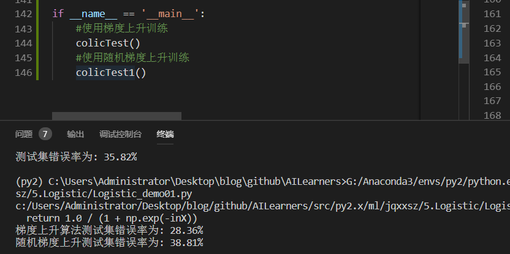

# 《机器学习实战》5.1Logistic回归项目案例：预测病马死亡率

> 搜索微信公众号:'AI-ming3526'或者'计算机视觉这件小事' 获取更多人工智能、机器学习干货  
> csdn：https://blog.csdn.net/baidu_31657889/  
> github：https://github.com/aimi-cn/AILearners

本文出现的所有代码，均可在github上下载，不妨来个Star把谢谢~：[Github代码地址](https://github.com/aimi-cn/AILearners/tree/master/src/py2.x/ml/jqxxsz/5.Logistic/Logistic_demo01.py)

## 1、项目简介
本次实战内容，将使用Logistic回归来预测患疝气病的马的存活问题。原始数据集下载地址：[数据集下载](https://cuijiahua.com/wp-content/themes/begin/inc/go.php?url=http://archive.ics.uci.edu/ml/datasets/Horse+Colic)

这里的数据包含了368个样本和28个特征。这种病不一定源自马的肠胃问题，其他问题也可能引发马疝病。该数据集中包含了医院检测马疝病的一些指标，有的指标比较主观，有的指标难以测量，例如马的疼痛级别。另外需要说明的是，除了部分指标主观和难以测量外，该数据还存在一个问题，数据集中有30%的值是缺失的。下面将首先介绍如何处理数据集中的数据缺失问题，然后再利用Logistic回归和随机梯度上升算法来预测病马的生死。

## 2、开发流程
1. 收集数据: 给定数据文件
2. 准备数据: 用 Python 解析文本文件并填充缺失值
3. 分析数据: 可视化并观察数据
4. 训练算法: 使用优化算法，找到最佳的系数
5. 测试算法: 为了量化回归的效果，需要观察错误率。根据错误率决定是否回退到训练阶段，通过改变迭代的次数和步长的参数来得到更好的回归系数
6. 使用算法: 实现一个简单的命令行程序来收集马的症状并输出预测结果并非难事，这可以作为留给大家的一道习题

> 收集数据: 给定数据文件

病马的训练数据已经给出来了，如下形式存储在文本文件中: [原始数据集地址](https://cuijiahua.com/wp-content/themes/begin/inc/go.php?url=http://archive.ics.uci.edu/ml/datasets/Horse+Colic)
```
1.000000	1.000000	39.200000	88.000000	20.000000	0.000000	0.000000	4.000000	1.000000	3.000000	4.000000	2.000000	0.000000	0.000000	0.000000	4.000000	2.000000	50.000000	85.000000	2.000000	2.000000	0.000000
2.000000	1.000000	38.300000	40.000000	24.000000	1.000000	1.000000	3.000000	1.000000	3.000000	3.000000	1.000000	0.000000	0.000000	0.000000	1.000000	1.000000	33.000000	6.700000	0.000000	0.000000	1.000000
```
> 准备数据: 用 Python 解析文本文件并填充缺失值
 
数据中的缺失值是一个非常棘手的问题，很多文献都致力于解决这个问题。那么，数据缺失究竟带来了什么问题？假设有100个样本和20个特征，这些数据都是机器收集回来的。若机器上的某个传感器损坏导致一个特征无效时该怎么办？它们是否还可用？答案是肯定的。因为有时候数据相当昂贵，扔掉和重新获取都是不可取的，所以必须采用一些方法来解决这个问题。下面给出了一些可选的做法：

- 使用可用特征的均值来填补缺失值；
- 使用特殊值来填补缺失值，如-1；
- 忽略有缺失值的样本；
- 使用相似样本的均值添补缺失值；
- 使用另外的机器学习算法预测缺失值。

现在，我们对下一节要用的数据集进行预处理，使其可以顺利地使用分类算法。预处理数据做两件事：

- 如果测试集中一条数据的特征值已经确实，那么我们选择实数0来替换所有缺失值，因为本文使用Logistic回归。因此这样做不会影响回归系数的值。sigmoid(0)=0.5，即它对结果的预测不具有任何倾向性。
- 如果测试集中一条数据的类别标签已经缺失，那么我们将该类别数据丢弃，因为类别标签与特征不同，很难确定采用某个合适的值来替换。

原始的数据集经过处理，保存为两个文件：horseColicTest.txt和horseColicTraining.txt。已经处理好的“干净”可用的数据集下载地址：

[horseColicTraining.txt](https://github.com/aimi-cn/AILearners/tree/master/data/ml/jqxxsz/sourceData/Ch05/horseColicTraining.txt)

[horseColicTest.txt](https://github.com/aimi-cn/AILearners/tree/master/data/ml/jqxxsz/sourceData/Ch05/horseColicTest.txt)

有了这些数据集，我们只需要一个Logistic分类器，就可以利用该分类器来预测病马的生死问题了。

> 分析数据: 可视化并观察数据

将数据使用 MatPlotlib 打印出来，观察数据是否是我们想要的格式

> 训练算法: 使用优化算法，找到最佳的系数

我们会使用上一节用到的梯度上升和改进之后的随机梯度上升算法进行训练

> 测试算法: 为了量化回归的效果，需要观察错误率。根据错误率决定是否回退到训练阶段，通过改变迭代的次数和步长的参数来得到更好的回归系数

我们要做的就是使用Python构建Logistic回归分类器。使用Logistic回归方法进行分类并不需要做很多工作，所需做的只是把测试集上每个特征向量乘以最优化方法得来的回归系数，再将乘积结果求和，最后输入到Sigmoid函数中即可。如果对应的Sigmoid值大于0.5就预测类别标签为1，否则为0。

我们先使用随机梯度上升算法计算错误率大小
然后使用改进的随机梯度上升算法计算错误率大小

代码如下：
```python
#!/usr/bin/env python
# -*- encoding: utf-8 -*-
'''
@File    :   Logistic_demo01.py
@Time    :   2019/05/27 16:31:12
@Author  :   xiao ming 
@Version :   1.0
@Contact :   xiaoming3526@gmail.com
@Desc    :   Logistic回归案例之预测病马死亡率
@github  :   https://github.com/aimi-cn/AILearners
'''

# here put the import lib
import numpy as np
import random

'''
@description: sigmoid函数
@param  inX - 数据
@return: sigmoid函数
'''
def sigmoid(inX):
    return 1.0 / (1 + np.exp(-inX))

'''
@description: 梯度上升法
@param {type} 两个参数：
第一个参数==> dataMatIn 是一个2维NumPy数组，每列分别代表每个不同的特征，每行则代表每个训练样本。
第二个参数==> classLabels 是类别标签，它是一个 1*100 的行向量。为了便于矩阵计算，需要将该行向量转换为列向量，做法是将原向量转置，再将它赋值给labelMat。
@return: 求得的权重数组(最优参数)
'''
def gradAscent(dataMatIn, classLabels):
    #用dataMatIn创建特征矩阵
    dataMatrix = np.mat(dataMatIn)
    #调换矩阵的坐标顺序，对于二维矩阵来说，transpose()就是转置 
    labelMat = np.mat(classLabels).transpose()
    #m是样本数，n是特征数
    m, n = np.shape(dataMatrix)
    #梯度上升步长
    alpha = 0.001   
    #最大迭代次数                                                     
    maxCycles = 500       
    #权重向量b，初始化为全1 这里面n为3                                                
    weights = np.ones((n,1))
    for k in range(maxCycles):
        #讲给定的值通过sigmoid函数输出为0-1之间的数值 #对w1*x1+w2*x2求对数几率回归
        h = sigmoid(dataMatrix * weights)      
        #计算真实值和预测值之间的误差                         
        error = labelMat - h
        #根据误差进行梯度更新
        weights = weights + alpha * dataMatrix.transpose() * error
    #.getA()将自身矩阵变量转化为ndarray类型的变量
    return weights

'''
@description: 改进的随机梯度上升算法
@param  dataMatrix - 数据数组
        classLabels - 数据标签
        numIter - 迭代次数
@return: weights - 求得的回归系数数组(最优参数)
'''
def stocGradAscent1(dataMatrix, classLabels, numIter=150):
    #返回dataMatrix的大小。m为行数,n为列数。
    m,n = np.shape(dataMatrix)
    #参数初始化
    weights = np.ones(n)
    # 随机梯度, 循环150,观察是否收敛
    for j in range(numIter):
        # [0, 1, 2 .. m-1]
        dataIndex = list(range(m))
        for i in range(m):
            # i和j的不断增大，导致alpha的值不断减少，但是不为0
            alpha = 4/(1.0+j+i)+0.0001
            # 随机产生一个 0～len()之间的一个值
            # random.uniform(x, y) 方法将随机生成下一个实数，它在[x,y]范围内,x是这个范围内的最小值，y是这个范围内的最大值。
            randIndex = int(np.random.uniform(0,len(dataIndex)))
            # sum(dataMatrix[i]*weights)为了求 f(x)的值， f(x)=a1*x1+b2*x2+..+nn*xn
            h = sigmoid(sum(dataMatrix[randIndex]*weights))
            error = classLabels[randIndex] - h
            #更新回归系数
            weights = weights + alpha * error * dataMatrix[randIndex]
            #删除已经使用的样本
            del(dataIndex[randIndex])
    return weights

def colicTest():
    frTrain = open('C:/Users/Administrator/Desktop/blog/github/AILearners/data/ml/jqxxsz/5.Logistic/horseColicTraining.txt')                                        #打开训练集
    frTest = open('C:/Users/Administrator/Desktop/blog/github/AILearners/data/ml/jqxxsz/5.Logistic/horseColicTest.txt')                                                #打开测试集
    trainingSet = []; trainingLabels = []
    for line in frTrain.readlines():
        currLine = line.strip().split('\t')
        lineArr = []
        for i in range(len(currLine)-1):
            lineArr.append(float(currLine[i]))
        trainingSet.append(lineArr)
        trainingLabels.append(float(currLine[-1]))
    #使用梯度上升训练
    trainWeights = gradAscent(np.array(trainingSet), trainingLabels)       
    errorCount = 0; numTestVec = 0.0
    for line in frTest.readlines():
        numTestVec += 1.0
        currLine = line.strip().split('\t')
        lineArr =[]
        for i in range(len(currLine)-1):
            lineArr.append(float(currLine[i]))
        if int(classifyVector(np.array(lineArr), trainWeights[:,0]))!= int(currLine[-1]):
            errorCount += 1
    errorRate = (float(errorCount)/numTestVec) * 100                                 #错误率计算
    print("梯度上升算法测试集错误率为: %.2f%%" % errorRate).decode('utf-8').encode('gb2312')

def colicTest1():
    frTrain = open('C:/Users/Administrator/Desktop/blog/github/AILearners/data/ml/jqxxsz/5.Logistic/horseColicTraining.txt')                                        #打开训练集
    frTest = open('C:/Users/Administrator/Desktop/blog/github/AILearners/data/ml/jqxxsz/5.Logistic/horseColicTest.txt')                                                #打开测试集
    trainingSet = []; trainingLabels = []
    for line in frTrain.readlines():
        currLine = line.strip().split('\t')
        lineArr = []
        for i in range(len(currLine)-1):
            lineArr.append(float(currLine[i]))
        trainingSet.append(lineArr)
        trainingLabels.append(float(currLine[-1]))
    #使用改进的随机上升梯度训练
    trainWeights = stocGradAscent1(np.array(trainingSet), trainingLabels)       
    errorCount = 0; numTestVec = 0.0
    for line in frTest.readlines():
        numTestVec += 1.0
        currLine = line.strip().split('\t')
        lineArr =[]
        for i in range(len(currLine)-1):
            lineArr.append(float(currLine[i]))
        if int(classifyVector(np.array(lineArr), trainWeights))!= int(currLine[-1]):
            errorCount += 1
    errorRate = (float(errorCount)/numTestVec) * 100                                 #错误率计算
    print("随机梯度上升测试集错误率为: %.2f%%" % errorRate).decode('utf-8').encode('gb2312')


def classifyVector(inX, weights):
    prob = sigmoid(sum(inX*weights))
    if prob > 0.5: return 1.0
    else: return 0.0

if __name__ == '__main__':
    #使用梯度上升训练
    colicTest()
    #使用随机梯度上升训练
    colicTest1()
```
运行结果如下：



随机梯度上升错误率还是蛮高的并且每次运行的错误率也是不同的，错误率高的时候可能达到40%多。为啥这样？首先，因为数据集本身有30%的数据缺失，这个是不能避免的。另一个主要原因是，我们使用的是改进的随机梯度上升算法，因为数据集本身就很小，就几百的数据量。用改进的随机梯度上升算法显然不合适。

我们看到梯度上升算法错误率稳定且较低。很显然，使用随机梯度上升算法，反而得不偿失了。

所以可以得到如下结论：

- 当数据集较小时，我们使用梯度上升算法
- 当数据集较大时，我们使用改进的随机梯度上升算法

> 使用算法: 实现一个简单的命令行程序来收集马的症状并输出预测结果并非难事，这可以作为留给大家的一道习题

补充：对于这么复杂的分类算法 以及之后要学习的支持向量机SVM 都是非常复杂的 是不是很害怕自己写不出来代码 不用担心 这些东西其他开发者都为我们想好了 我们直接调用api就可以了 我们最好是了解一下他的原理 具体实现细节不会也无妨 我这里准备了使用sklearn实现Logistic回归的代码 核心代码只有两行就可以实现这样的算法 有兴趣的小伙伴去[sklearn官网](https://scikit-learn.org/dev/modules/generated/sklearn.linear_model.LogisticRegression.html#sklearn.linear_model.LogisticRegression)查看 

sklearn.linear_model模块提供了很多模型供我们使用，比如Logistic回归、Lasso回归、贝叶斯脊回归等，可见需要学习的东西还有很多很多。

我使用了liblinear和sag方法进行实现

完整代码地址：https://github.com/aimi-cn/AILearners/tree/master/src/py2.x/ml/jqxxsz/5.Logistic/Logistic_demo02.py

liblinear(使用了开源的liblinear库实现，内部使用了坐标轴下降法来迭代优化损失函数)

sag方法(即随机平均梯度下降，是梯度下降法的变种，和普通梯度下降法的区别是每次迭代仅仅用一部分的样本来计算梯度，适合于样本数据多的时候。)

核心代码(两行)：
```python
    # 使用solver优化算法选择参数，只有五个可选参数 我们使用liblinear和sag进行优化
    # max_iter：算法收敛最大迭代次数，int类型，默认为10
    classifier = LogisticRegression(solver='liblinear',max_iter=10).fit(trainingSet, trainingLabels)
    classifier2 = LogisticRegression(solver='sag',max_iter=3000).fit(trainingSet, trainingLabels)
    # score方法返回测试之后的正确率
    test_accurcy = classifier.score(testSet, testLabels) * 100
    print("正确率为: %.2f%%" % test_accurcy).decode('utf-8').encode('gb2312')

```

对于每个函数的具体使用，可以看下官方文档：[点我查看](https://scikit-learn.org/dev/modules/generated/sklearn.linear_model.LogisticRegression.html#sklearn.linear_model.LogisticRegression)

