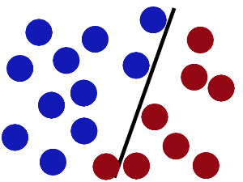
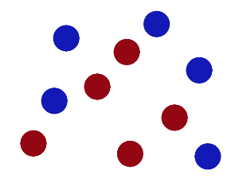
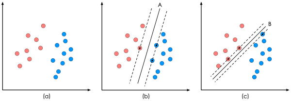
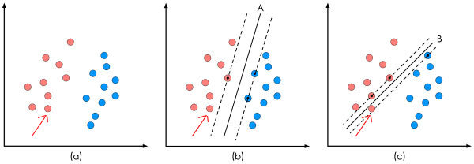
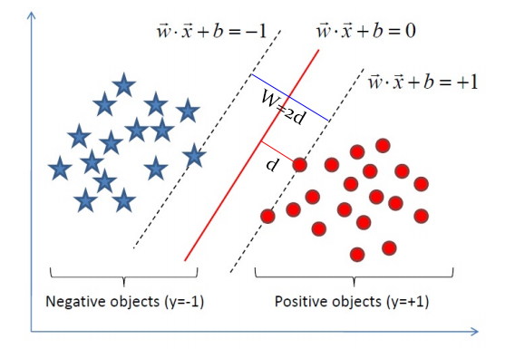
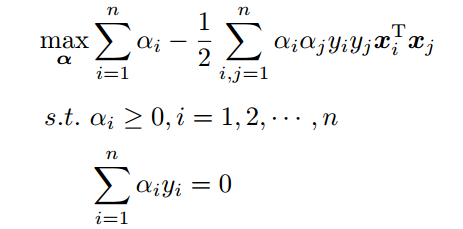
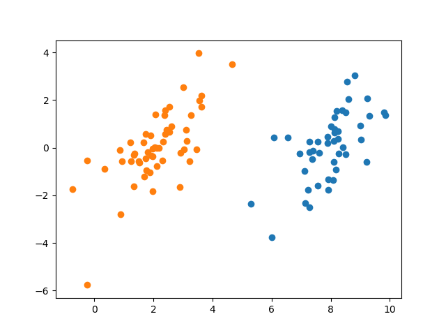
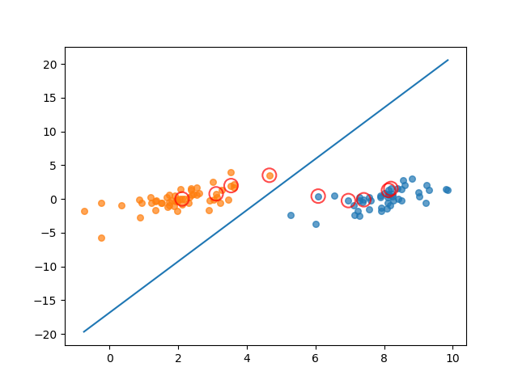

# 《机器学习实战》6.1支持向量机SVM基础之处理简单的线性SVM

> 搜索微信公众号:'AI-ming3526'或者'计算机视觉这件小事' 获取更多人工智能、机器学习干货  
> csdn：https://blog.csdn.net/baidu_31657889/  
> github：https://github.com/aimi-cn/AILearners

本文出现的所有代码，均可在github上下载，不妨来个Star把谢谢~：[Github代码地址](https://github.com/aimi-cn/AILearners/tree/master/src/py2.x/ml/jqxxsz/6.SVM)

### 一、前言
对于SVM这个理论，本人感觉是非常难理解的 借鉴了很多大佬的笔记和视频 还是想以自己能理解的方式进行阐述清楚SVM是什么东西 他的具体实现 所以我尽量少点涉及公式什么的 通俗的介绍SVM

### 二、什么是SVM
SVM的英文全称是Support Vector Machines，我们叫它支持向量机。支持向量机是我们用于分类的一种算法。让我们以一个小故事的形式，开启我们的SVM之旅吧。

在很久以前的情人节，一位大侠要去救他的爱人，但天空中的魔鬼和他玩了一个游戏。

魔鬼在桌子上似乎有规律放了两种颜色的球，说："你用一根棍分开它们？要求：尽量在放更多球之后，仍然适用。"


于是大侠这样放，干的不错？


然后魔鬼，又在桌上放了更多的球，似乎有一个球站错了阵营。显然，大侠需要对棍做出调整。



**SVM就是试图把棍放在最佳位置，好让在棍的两边有尽可能大的间隔。这个间隔就是球到棍的距离。**


现在好了，即使魔鬼放了更多的球，棍仍然是一个好的分界线。


魔鬼看到大侠已经学会了一个trick(方法、招式)，于是魔鬼给了大侠一个新的挑战。



现在，大侠没有棍可以很好帮他分开两种球了，现在怎么办呢？当然像所有武侠片中一样大侠桌子一拍，球飞到空中。然后，凭借大侠的轻功，大侠抓起一张纸，插到了两种球的中间。


现在，从空中的魔鬼的角度看这些球，这些球看起来像是被一条曲线分开了。


再之后，无聊的大人们，把这些球叫做data，把棍子叫做classifier(分类器也可叫做分隔超平面), 找到最大间隔的trick叫做optimization(最优化)，拍桌子叫做kernelling(核函数), 那张纸叫做hyperplane(超平面)。

更为直观地感受一下吧(需要翻墙)：https://www.youtube.com/watch?v=3liCbRZPrZA

概述一下：

当一个分类问题，数据是线性可分的，也就是用一根棍就可以将两种小球分开的时候，我们只要将棍的位置放在让小球距离棍的距离最大化的位置即可，寻找这个最大间隔的过程，就叫做最优化，这条分隔直线称为分隔超平面(separating hyperplane)。但是，现实往往是很残酷的，一般的数据是线性不可分的，也就是找不到一个棍将两种小球很好的分类。这个时候，我们就需要像大侠一样，将小球拍起，用一张纸代替小棍将小球进行分类。想要让数据飞起，我们需要的东西就是核函数(kernel)，用于切分小球的纸，就是超平面。

也许这个时候，你还是似懂非懂，没关系。根据刚才的描述，可以看出，问题是从线性可分延伸到线性不可分的。那么，我们就按照这个思路，进行原理性的剖析。

### 三、线性SVM

先看下线性可分的二分类问题。



上图中的(a)是已有的数据，红色和蓝色分别代表两个不同的类别。数据显然是线性可分的，但是将两类数据点分开的直线显然不止一条。上图的(b)和(c)分别给出了B、C两种不同的分类方案，其中黑色实线为分界线，术语称为‘分隔超平面’。每个分隔超平面对应了一个线性分类器。虽然从分类结果上看，分类器A和分类器B的效果是相同的。但是他们的性能是有差距的，看下图：



在分隔超平面不变的情况下，我又添加了一个红点。可以看到，分类器B依然能很好的分类结果，而分类器C则出现了分类错误。显然分类器B的分隔超平面放置的位置优于分类器C的分隔超平面放置的位置，SVM算法也是这么认为的，它的依据就是分类器B的分类间隔比分类器C的分类间隔大。这里涉及到第一个SVM独有的概念"分类间隔"。在保证分隔超平面方向不变且不会出现错分样本的情况下移动分隔超平面，会在原来的分隔超平面两侧找到两个极限位置（越过该位置就会产生错分现象），如虚线所示。虚线的位置由分隔超平面的方向和距离原分隔超平面最近的几个样本的位置决定。而这两条平行虚线正中间的分界线就是在保持当前分隔超平面方向不变的前提下的最优分隔超平面。两条虚线之间的垂直距离就是这个最优分隔超平面对应的分类间隔。显然每一个可能把数据集正确分开的方向都有一个最优分隔超平面（有些方向无论如何移动分隔超平面的位置也不可能将两类样本完全分开），而不同方向的最优分隔超平面的分类间隔通常是不同的，那个具有“最大间隔”的分隔超平面就是SVM要寻找的最优解。而这个真正的最优解对应的两侧虚线所穿过的样本点，就是SVM中的支持样本点，称为"支持向量"。也就是图中被虚线穿过的红点和蓝点里面有黑色标记的样本点就是SVM的支持向量。

ok到这部分我们还没有涉及到复杂的公式推导 下面我们就会涉及到一点公式推导了 我尽量用简答明理的方式来说明

我们求解这个‘分隔超平面’的过程，也就是求出线性可分数据那条分类直线的过程，然后求出最大的分类间隔，就是最优化。

一个最优化问题通常有两个基本的因素：1）目标函数，也就是你希望什么东西的什么指标达到最好；2）优化对象，你期望通过改变哪些因素来使你的目标函数达到最优。

**(1)"分类间隔"方程**

在线性SVM算法中，目标函数显然就是那个"分类间隔"，而优化对象则是分隔超平面。

我们可以看下图：



分隔超平面的形式可写成$w^x+b$ 我们已经知道分类间隔的大小实际上就是支持向量(虚线穿过的点)对应的样本点到分隔超平面的距离的二倍。图中d求出来就是分类间隔。

我们高中都学过，点到直线的距离距离公式如下：


现在，将直线方程扩展到多维，求得我们现在的分类间隔公式如下：


我们目的是为了找出一个分类效果好的超平面作为分类器。分类器的好坏的评定依据是分类间隔W=2d的大小，即分类间隔w越大，我们认为这个超平面的分类效果越好。此时，求解超平面的问题就变成了求解分类间隔W最大化的为题。W的最大化也就是d最大化的。

在这里我们看到两条虚线是优化的变量d的取值范围  也就是在这里我们设定直线值大于1的是红色球 小于1的是蓝色球   

即：假设超平面可以完全正确地将所有样本分类，则对于任意一个样本（xi，yi）来说都有如下性质（注：这里样本的标签用+1代表正例，-1代表反例）：


上述方程即给出了SVM最优化问题的约束条件。这样标记方便我们将上述方程变成如下形式：也就可以理解为所有样本点到直线$wx+b=0$的距离都大于1.


**（2）"分隔超平面"方程**

我们会头疼这里的具体推倒是怎么产生的那，比如$w^x+b$分隔超平面的公式为什么写成这样 以及从二维的点到直线距离扩展为多维的是怎么扩展的那 其实是很简单的 我们来简单说下 

我们都知道二维空间下一条直线的方式如下所示：$y=ax+b$

现在我们做个小小的改变，让原来的x轴变成x1，y轴变成x2：$x_2=ax_1+b$

移项得：$ax_1-x_2+b=0$

将公式向量化得：


进一步向量化，用w列向量和x列向量和标量γ进一步向量化：$w^T+b=0$

其中，向量w和x分别为：


二维空间的直线方程已经推导完成，将其推广到n维空间，就变成了超平面方程。(一个超平面，在二维空间的例子就是一个直线)但是它的公式没变，依然是：$w^T+b=0$

不同之处在于：


这样推倒之后我们可以非常直观的看出来分隔超平面这条直线和分类间隔是怎么从一维扩展到多维的了。

**(3)线性SVM优化问题基本描述**

现在整合一下思路，我们已经得到我们的目标函数：


我们的优化目标是是d最大化。我们已经说过，我们是用支持向量上的样本点求解d的最大化的问题的。那么支持向量上的样本点有什么特点呢？


所有支持向量上的样本点，都满足如上公式。如果不赞同，请重看"分类间隔"方程推导过程。也就是这个方程绝对值都是满足等于1的。

现在我们就可以将我们的目标函数进一步化简：


因为，我们只关心支持向量上的点。随后我们求解d的最大化问题变成了||w||的最小化问题。进而||w||的最小化问题等效于


为什么要做这样的等效呢？这是为了在进行最优化的过程中对目标函数求导时比较方便，但这绝对不影响最优化问题最后的求解。我们将最终的目标函数和约束条件放在一起进行描述：


现在我们的优化问题变成了如上的形式

这里n是样本点的总个数，缩写s.t.表示"Subject to"，是"服从某某条件"的意思。上述公式描述的是一个典型的不等式约束条件下的二次型函数优化问题，同时也是支持向量机的基本数学模型。

SVM就是来解决上面这个方程的优化问题。再经过拉格朗日公式和KKT条件等数学运算最后找出分类器定义中的w和b。

我这样只是把简单的SVM最基本的概念讲清楚了 对于更复杂的SVM优化问题 以及优化我们可以参照这个网址进行理解：https://cuijiahua.com/blog/2017/11/ml_8_svm_1.html

总之经过复杂的推论 拉格朗日公式和KKT条件等数学运算之后 现在我们的优化问题变成了如下的形式：



现在我们的优化问题变成了如上的形式。对于这个问题，我们有更高效的优化算法，即序列最小优化（SMO）算法。我们通过这个优化算法能得到α，再根据α，我们就可以求解出w和b，进而求得我们最初的目的：找到分隔超平面。

下面我们来谈谈SVM的一种高效的优化算法，序列最小化SMO算法

四、序列最小化SMO算法

对于上面提到的最优化的这个问题，我们有更高效的优化算法，即序列最小优化（SMO）算法。我们通过这个优化算法能得到α，再根据α，我们就可以求解出w和b，进而求得我们最初的目的：找到分隔超平面。

### 序列最小优化(Sequential Minimal Optimization, SMO)

- 创建作者：John Platt
- 创建时间：1996年
- SMO用途：用于训练 SVM
- SMO目标：求出一系列 alpha 和 b,一旦求出 alpha，就很容易计算出权重向量 w 并得到分隔超平面。
- SMO思想：是将大优化问题分解为多个小优化问题来求解的。
- SMO原理：每次循环选择两个 alpha 进行优化处理，一旦找出一对合适的 alpha，那么就增大一个同时减少一个。
  - 这里指的合适必须要符合一定的条件
    -  这两个 alpha 必须要在间隔边界之外
    - 这两个 alpha 还没有进行过区间化处理或者不在边界上。

SMO 伪代码大致如下：
```
创建一个 alpha 向量并将其初始化为0向量
当迭代次数小于最大迭代次数时(外循环)
    对数据集中的每个数据向量(内循环)：
        如果该数据向量可以被优化
            随机选择另外一个数据向量
            同时优化这两个向量
            如果两个向量都不能被优化，退出内循环
    如果所有向量都没被优化，增加迭代数目，继续下一次循环
```

五、编程求解线性SVM

已经梳理完了SMO算法实现步骤，接下来按照这个思路编写代码，进行实战练习。

SVM开发流程
1. 收集数据：可以使用任意方法。
2. 准备数据：需要数值型数据。
3. 分析数据：有助于可视化分隔超平面。
4. 训练算法：SVM的大部分时间都源自训练，该过程主要实现两个参数的调优。
5. 测试算法：十分简单的计算过程就可以实现。
6. 使用算法：几乎所有分类问题都可以使用SVM，值得一提的是，SVM本身是一个二类分类器，对多类问题应用SVM需要对代码做一些修改。

我们先使用简单的数据集进行测试，数据集下载地址：[数据集下载](https://github.com/aimi-cn/AILearners/tree/master/data/ml/jqxxsz/6.SVM/testSet.txt)

代码地址：https://github.com/aimi-cn/AILearners/tree/master/src/py2.x/ml/jqxxsz/6.SVM/svm.py

### 收集数据
文本文件格式：

```
3.542485	1.977398	-1
3.018896	2.556416	-1
7.551510	-1.580030	1
2.114999	-0.004466	-1
8.127113	1.274372	1
```

### 准备数据
读取数据
```python
def loadDataSet(filename):
    dataMat = []; labelMat = []
    fr = open(filename)
    #逐行读取，滤除空格等
    for line in fr.readlines():
        lineArr = line.strip().split('\t')
        dataMat.append([float(lineArr[0]), float(lineArr[1])])
        labelMat.append(float(lineArr[2]))
    return dataMat,labelMat
```

### 分析数据
编写程序可视化数据集，看下它是长什么样的：
```python
def showDataSet(dataMat,labelMat):
    #正样本
    data_plus = []     
    #负样本                             
    data_minus = []                                 
    for i in range(len(dataMat)):
        if labelMat[i] > 0:
            data_plus.append(dataMat[i])
        else:
            data_minus.append(dataMat[i])
    #转换为numpy矩阵
    data_plus_np = np.array(data_plus)              
    data_minus_np = np.array(data_minus)           
    #正样本散点图
    plt.scatter(np.transpose(data_plus_np)[0], np.transpose(data_plus_np)[1])   
    #负样本散点图
    plt.scatter(np.transpose(data_minus_np)[0], np.transpose(data_minus_np)[1]) 
    plt.show()

if __name__ == "__main__":
    dataMat,labelMat = loadDataSet('C:/Users/Administrator/Desktop/blog/github/AILearners/data/ml/jqxxsz/6.SVM/testSet.txt')
    showDataSet(dataMat,labelMat)
```

运行结果：



这就是我们使用的二维数据集，显然线性可分。现在我们使用简化版的SMO算法进行求解。

### 训练算法

简化版SMO算法

按照上述已经推导的步骤编写代码：
```python
#!/usr/bin/env python
# -*- encoding: utf-8 -*-
'''
@File    :   svm.py
@Time    :   2019/06/01 16:24:58
@Author  :   xiao ming 
@Version :   1.0
@Contact :   xiaoming3526@gmail.com
@Desc    :   SVM支持向量机处理线性数据
@github  :   https://github.com/aimi-cn/AILearners
'''
import matplotlib.pyplot as plt
import numpy as np
import random

'''
@description: 读取数据
@param：fileName - 文件名
@return: dataMat - 数据矩阵
        labelMat - 数据标签
'''
def loadDataSet(filename):
    dataMat = []; labelMat = []
    fr = open(filename)
    #逐行读取，滤除空格等
    for line in fr.readlines():
        lineArr = line.strip().split('\t')
        dataMat.append([float(lineArr[0]), float(lineArr[1])])
        labelMat.append(float(lineArr[2]))
    return dataMat,labelMat

'''
@description: 随机选择alpha
@param: i - alpha
        m - alpha参数个数
@return: j
'''
def selectJrand(i, m):
    #选择一个不等于i的j
    j = i                                 
    while (j == i):
        j = int(random.uniform(0, m))
    return j

'''
@description: 修剪alpha
@param: aj - alpha值
        H - alpha上限
        L - alpha下限
@return: aj - alpah值
'''
def clipAlpha(aj,H,L):
    if aj > H:
        aj = H
    if L > aj:
        aj = L
    return aj

'''
@description: 简化版SMO算法
@param: dataMatIn - 数据矩阵
        classLabels - 数据标签
        C - 惩罚参数
        toler - 松弛变量
        maxIter - 最大迭代次数
@return: 
'''
def smoSimple(dataMatIn, classLabels, C, toler, maxIter):
    #转换为numpy的mat存储
    dataMatrix = np.mat(dataMatIn); labelMat = np.mat(classLabels).transpose()
    #初始化b参数，统计dataMatrix的维度
    b = 0; m,n = np.shape(dataMatrix)
    #初始化alpha参数，设为0
    alphas = np.mat(np.zeros((m,1)))
    #初始化迭代次数
    iter_num = 0
    #最多迭代matIter次
    while (iter_num < maxIter):
        alphaPairsChanged = 0
        for i in range(m):
            #步骤1：计算误差Ei
            fXi = float(np.multiply(alphas,labelMat).T*(dataMatrix*dataMatrix[i,:].T)) + b
            Ei = fXi - float(labelMat[i])
            #优化alpha，更设定一定的容错率。
            if ((labelMat[i]*Ei < -toler) and (alphas[i] < C)) or ((labelMat[i]*Ei > toler) and (alphas[i] > 0)):
                #随机选择另一个与alpha_i成对优化的alpha_j
                j = selectJrand(i,m)
                #步骤1：计算误差Ej
                fXj = float(np.multiply(alphas,labelMat).T*(dataMatrix*dataMatrix[j,:].T)) + b
                Ej = fXj - float(labelMat[j])
                #保存更新前的aplpha值，使用深拷贝
                alphaIold = alphas[i].copy(); alphaJold = alphas[j].copy();
                #步骤2：计算上下界L和H
                if (labelMat[i] != labelMat[j]):
                    L = max(0, alphas[j] - alphas[i])
                    H = min(C, C + alphas[j] - alphas[i])
                else:
                    L = max(0, alphas[j] + alphas[i] - C)
                    H = min(C, alphas[j] + alphas[i])
                if L==H: print("L==H"); continue
                #步骤3：计算eta
                eta = 2.0 * dataMatrix[i,:]*dataMatrix[j,:].T - dataMatrix[i,:]*dataMatrix[i,:].T - dataMatrix[j,:]*dataMatrix[j,:].T
                if eta >= 0: print("eta>=0"); continue
                #步骤4：更新alpha_j
                alphas[j] -= labelMat[j]*(Ei - Ej)/eta
                #步骤5：修剪alpha_j
                alphas[j] = clipAlpha(alphas[j],H,L)
                if (abs(alphas[j] - alphaJold) < 0.00001): print("alpha_j变化太小"); continue
                #步骤6：更新alpha_i
                alphas[i] += labelMat[j]*labelMat[i]*(alphaJold - alphas[j])
                #步骤7：更新b_1和b_2
                b1 = b - Ei- labelMat[i]*(alphas[i]-alphaIold)*dataMatrix[i,:]*dataMatrix[i,:].T - labelMat[j]*(alphas[j]-alphaJold)*dataMatrix[i,:]*dataMatrix[j,:].T
                b2 = b - Ej- labelMat[i]*(alphas[i]-alphaIold)*dataMatrix[i,:]*dataMatrix[j,:].T - labelMat[j]*(alphas[j]-alphaJold)*dataMatrix[j,:]*dataMatrix[j,:].T
                #步骤8：根据b_1和b_2更新b
                if (0 < alphas[i]) and (C > alphas[i]): b = b1
                elif (0 < alphas[j]) and (C > alphas[j]): b = b2
                else: b = (b1 + b2)/2.0
                #统计优化次数
                alphaPairsChanged += 1
                #打印统计信息
                print("第%d次迭代 样本:%d, alpha优化次数:%d" % (iter_num,i,alphaPairsChanged)).decode('utf-8').encode('gb2312')
        #更新迭代次数
        if (alphaPairsChanged == 0): iter_num += 1
        else: iter_num = 0
        print("迭代次数: %d" % iter_num)
    return b,alphas

'''
@description: 分类结果可视化
@param:
        dataMat - 数据矩阵
        w - 直线法向量
        b - 直线解决
@return: 
'''
def showClassifer(dataMat, w, b):
    #绘制样本点
    data_plus = []                                  #正样本
    data_minus = []                                 #负样本
    for i in range(len(dataMat)):
        if labelMat[i] > 0:
            data_plus.append(dataMat[i])
        else:
            data_minus.append(dataMat[i])
    data_plus_np = np.array(data_plus)              #转换为numpy矩阵
    data_minus_np = np.array(data_minus)            #转换为numpy矩阵
    plt.scatter(np.transpose(data_plus_np)[0], np.transpose(data_plus_np)[1], s=30, alpha=0.7)   #正样本散点图
    plt.scatter(np.transpose(data_minus_np)[0], np.transpose(data_minus_np)[1], s=30, alpha=0.7) #负样本散点图
    #绘制直线
    x1 = max(dataMat)[0]
    x2 = min(dataMat)[0]
    a1, a2 = w
    b = float(b)
    a1 = float(a1[0])
    a2 = float(a2[0])
    y1, y2 = (-b- a1*x1)/a2, (-b - a1*x2)/a2
    plt.plot([x1, x2], [y1, y2])
    #找出支持向量点
    for i, alpha in enumerate(alphas):
        if alpha > 0:
            x, y = dataMat[i]
            plt.scatter([x], [y], s=150, c='none', alpha=0.7, linewidth=1.5, edgecolor='red')
    plt.show()

'''
@description: 计算w
@param: dataMat - 数据矩阵
        labelMat - 数据标签
        alphas - alphas值
@return: 
'''
def get_w(dataMat, labelMat, alphas):
    alphas, dataMat, labelMat = np.array(alphas), np.array(dataMat), np.array(labelMat)
    w = np.dot((np.tile(labelMat.reshape(1, -1).T, (1, 2)) * dataMat).T, alphas)
    return w.tolist()

if __name__ == "__main__":
    dataMat,labelMat = loadDataSet('C:/Users/Administrator/Desktop/blog/github/AILearners/data/ml/jqxxsz/6.SVM/testSet.txt')
    b,alphas = smoSimple(dataMat, labelMat, 0.6, 0.001, 40)
    w = get_w(dataMat, labelMat, alphas)
    showClassifer(dataMat, w, b)
```

程序运行结果：


其中，中间的蓝线为求出来的分类器，用红圈圈出的点为支持向量点。

### SMO算法优化

在几百个点组成的小规模数据集上，简化版SMO算法的运行是没有什么问题的，但是在更大的数据集上的运行速度就会变慢。简化版SMO算法的第二个α的选择是随机的，针对这一问题，我们可以使用启发式选择第二个α值，来达到优化效果。

优化之后的SMO代码：

代码地址：
https://github.com/aimi-cn/AILearners/tree/master/src/py2.x/ml/jqxxsz/6.SVM/svm_demo01.py

完整版SMO算法(上图)与简化版SMO算法运行结果(下图)对比如下图所示：




图中画红圈的样本点为支持向量上的点，是满足算法的一种解。完整版SMO算法覆盖整个数据集进行计算，而简化版SMO算法是随机选择的。可以看出，完整版SMO算法选出的支持向量样点更多，更接近理想的分隔超平面。

对比两种算法的运算时间，我的测试结果是完整版SMO算法的速度比简化版SMO算法的速度快6倍左右。

其实，优化方法不仅仅是简单的启发式选择，还有其他优化方法，SMO算法速度还可以进一步提高。