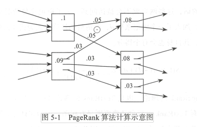
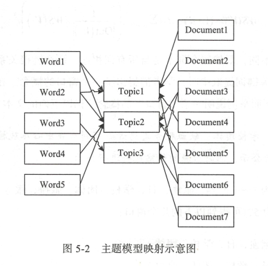
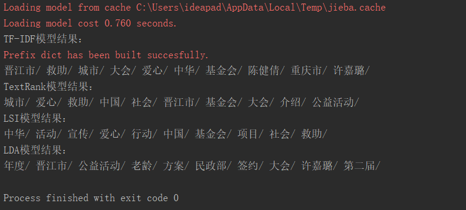
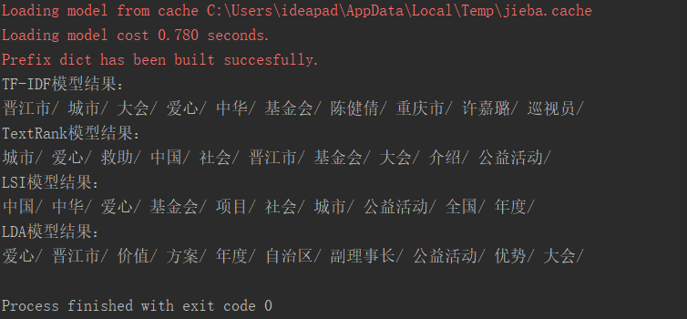

# 第五章关键词提取算法

> 搜索微信公众号:‘AI-ming3526’或者’计算机视觉这件小事’ 获取更多干货  
> github：https://github.com/aimi-cn/AILearners  

​	在本章，你将了解目前较为实用的关键词提取技术。 关键词是代表文章重要 内 容的 一组词 。 对文本聚类、分类、自动摘要等起重要的作用 。 此外 ， 它还能使人们便捷地浏 览和获取信息 。 现实中大量文本不包含关键词 ，自动提取关键词技术也因此具有重要意 义和价值。

本章的要点包括 ：

- 关键词提取技术介绍
- 常用的关键词提取算法详解 
- 文本关键词提取实战

## 5.1 关键词提取技术概述

​	在信息爆炸的时代，很多信息我们无法全面接收，我们需要从中筛选出一些我们感 兴趣的或者说对我们有用的信息进行接收。 怎么选择呢，关键词提取就是其中一个很好 的方法。 如果我们可以准确地将所有文档都用几个简单的关键词描述出来 ，那我们单看 几个关键词就可以了解一篇文章是不是我们所需要 的 ，这样会大大提高我们的信息获取效率。

​	类似于其他的机器学 习 方法 ， 关键词提取算法一般也可以分为有监督和无监督两类。

​	有监督的关键词提取方法主要是通过分类的方式进行，通过构建一个较为丰富和完善的 词表，然后通过判断每个文档与词表中每个词的匹配程度，以类似打标签的方式，达到 关键词提取的效果 。 有监督的方法能够获取到较高的精度，但缺点是需要大批量的标注 数据，人工成本过高 。 另外，现在每天的信息量增加过多，会有大量的新信息出现， 一 个固定的词表有时很难将新信息的内容表达出来，但是要人工维护这个受控的词表却要 很高的人力成本，这也是使用有监督方法来进行关键词提取的一个比较大的缺陷 。

​	相对于有监督的方法而言，无监督的方法对数据的要求就低多了 。 既不需要一张人 工生成、维护的词表，也不需要人工标准语料辅助进行训练。 因 此 ，这类算法在关键词 提取领域的应用更受到大家的青睐 。 在本章中，主要为大家介绍的就是一些目前较常用 的无监督关键词提取算法，分别是 TF -ID F 算法、 TextRank 算法和主题模型算法（包括 L S A 、 LSI 、 LD A 等） 。

## 5.2 关键词提取算法 TF/IDF 算法

​	TF -ID F 算法（ Term Frequency-Inverse Document Fre qu e n cy ，词频一 逆 文档频次算 法）是一种基于统计的计算方法，常用于评估在一个文档集中一个词对某份文档的重要 程度 。 这种作用显然很符合关键词抽取的需求，一个词对文档越重要，那就越可能是文 档的关键词，人们常将 TF- ID F 算法应用于关键词提取中 。

​	从算法 的名称就可以看出， TF - IDF 算法由两部分组成： TF 算法以及 ID F 算法。 TF 算法是统计一个词在一篇文档中出现的频次，其基本思想是，一个词在文档中出 现的次 数越多， 则 其对文档的表达能力也就越强 。 而 ID F 算法则是统计一个词在文档集的多少 个文档中出现，其基本的思想是，如果一个词在越少的文档中出现， 则其对文档的区分能力也就越强 。

​	TF 算法和 ID F 算法也能单独使用，在最早的时候就是如此。 但是在使用过程中，学 者们发现这两种算法都有其不足之处 。 TF 仅衡量词的出现频次，但是没有考虑到词的对 文档的区分能力 。 比如针对下面这篇文档 ：

​	`世界献血日，学校团体、献血服务 志愿者等可到 血液中心参观检验加 工过程，我们 会对检验结果进行公示，同时血液的价格也将进行公示 。`

​	上文中‘献血”“血液”“进行”“公示”等词出现的频次均为 2 ，如果从 TF 算法的角度， 他们对于这篇文档的重要性是一样的 。 但是实际上明显“血液”“献血”对这篇文档来说 更关键 。 而 IDF 则是相反，强调的是词 的区分能力，但是一个词既然能在一篇文档中频 繁 出现，那说明这个词能够很好地表现该篇文档 的特征， 忽 略这一点显然也是不合理的 。 于是，学者们将这两种算法综合进行使用，构成 TF-IDF 算法，从词频、逆文档频次两个 角度对词的重要性进行衡量。

​	在实际使用中， TF 的计 算常用式（ 5.1 ） 。 其中 nij 表示词 i 在文档j 中的出现频 次 ，但是仅用频 次来表示，长文本中的词出现频次高的概率会更大，这一点会影响到 不同文档之间关键词权值的比较。 所以在计算的过程中一般会对词频进行归一化 。 分母 部分就是统计文档中 每个同出现次数的总和 也就是文档的总词数。 还是 以上文文档为 例，“献血”一词出现次数为 2 ，文挡的总词数为 30 ，则 tf （献血 ） = n （献血） In （总）＝ 2 / 30  ≈0 . 067 。 更直白 的表示方式就是 ， tf (word ) = (wo rd 在文档中 出现的次数）／（文 档总词数） 。

​	

​	而 IDF 的计算常用 式（ 5.2 ） 。 IDI 为文档集中总文档数， I DiI 为文档集中出现词 i 的 文档数量 。 分母加 1是采用了拉普拉斯平滑 避免有部分新的词没有在语料库中出现过 而导致分母为零的情况出现， 增强算法 的健壮性 。

​						

​	TF - IDF 算法就是 TF 算法与 IDF 算法 的综合使用，具体计算方法见式（ 5.3 ） 。 对于 这两种方法怎么组合，学者们也做了很多的研究 tf 和l idf 是相加还是相乘， idf 的计算 究竟要取对数还是不取对数。 经过大量 的理论推导和实验研究后，发现式（ 5.3 ）的计算 方式是较为有效的计算方式之一。

​			


​	以上文文档为例，经过计算得到“献血”“血液”“进行”“公示”四个词出现的频次 均为 2 ，因 此他们的 tf 值都是 0.067 。 现假设我们具有的文档集有 1000 篇文档，其中出 现“献血”“血液”“进行”“公示”的文档数分别为 10 、 15 、 100 、 50 ，则根据式（ 5.2 ), idf （献血） = log ( 1000/10 ) = 10 。 同理可得， idf （ 血液） = 4.20, idf （进行） = 2.30, idf （进行） = 3 . 00 。 得到这些信息后，根据式（ 5.3 ）计算每个词 的 tf-idf 值 ，可 以知 道“献 血” 的 tf-idf 值最高，为最适合这篇文档的关键词 。 当然，关键词数量可以不止一个，可 以根据 tf-i df 值由大到小排序取前 n 个作为关键词 。

​	除了上面提到的传统的 TF - IDF 算法之外， TF -IDF 算法也有很多变种的加权方法。 传统的 TF - IDF 算法 中，仅考虑了词 的两个统计信息（出 现频次、在多少个文档出现 ）， 因此，其对文本的信息利用程度显然也是很少的 。 除了上面的信息外，在一个文本中还 有许多信息能对关键词 的提取起到很好的指导作用 ，例如每个词的词性 、 出现的位置等。 在某些特定的场景 中，如在传统的 TF” IDF 基础上 ， 加上这些辅助信息 ，能对关键词提 取的效果起到很好的提高作用 。 在文本 中，名同作为一种定义现实实体 的词 ，带有更多 的关键信息，如在关键词提取过程中，对名词赋予更高的权重，能使提取出来的关键词 更合理。 此外， 在某些场景中，文本的起始段落和末尾段落比起其他部分的文本更重要， 如对出现在这些位置的词赋予更高的权重，也能提高关键词的提取效果。 算法本身的定 义是死的，但是结合我们的应用场景，对算法进行合适的重塑及改造 ，使之更适应对应 场景的应用环境， 无疑能对我们想要得到 的结果起到更好的指导作用 。

## 5.3 TextRank 算法

​	在本节我们会讲到 TextRank 算法，与本章提到的其他算法都不同的一点是 ，其他算 法的关键词提取都要基于一个现成的语料库 。 如在 TF-IDF 中需要统计每个词在语料库 中 的多少个文档有出现过，也就是逆文档频率；主题模型的关键词提取算法则是要通过对 大规模文档的学习 ， 来发现文档 的隐含主题。 而 TextRank 算法则是可以脱离语料库的背景，仅对单篇文档进行分析就可以提取该文档的关键词 。 这也是 TextRank 算法的一个重 要特点 。 TextRank 算法最早用于文档的自动摘要，基于句子维度的分析，利用 TextRank 对每个句子进行打分，挑选出分数最高的 n 个句子作为文档的关键句，以达到自动摘要 的效果 。

​	TextRank 算法的基本思想来源于 Google 的 Page Rank 算法。 因此在介绍 TextRank 之前，有必要先了解下 PageRank 算法。

​	Page Rank 算法是 Goog l e 创始人拉里·佩奇和谢尔盖·布林于 1997 年构建早期的搜 索系统原型时提出的链接分析算法，该算法是他们用来评价搜索系统过覆盖网页重要性 的一种重要方法，随着 Goog l e 的成功，该算法也成为其他搜索引擎和学术界十分关注的 计算模型 。

​						

PageRank 算法是一种网页排名算法，其基本思想有两条 ：

1. 链接数量 。一个网页被越多的其他网页链接，说明这个网页越重要 。
2. 链接质量。 一个网页被一个越高权值的网页链接，也能表明这个网页越重要 。

基于上述思想，一个网页的 PageRank 值计算公式为式（ 5.4 ） 。

In(vi)为Vi的入链集合，同理， Out(Vi)为Vi的出链集合，｜out(Vj)｜则是出链的数量 。因为每个网页要将它自身的分数平均地贡献给每个出链，则 即为Vj月贡献给Vi的分数。 将Vi的所有入链贡献给他的分数全部加起来，就是Vi自身的得分。 

​						

​	当然，以这种方式来计算每个网页的分数就会有一个问题：每个网页的得分都与其 链接网页的分数有关，那么其链接网页的分数又该怎么确定呢？为了解决这个问题，算 法开始时会将所有网页的得分初始化为1，然后通过多次迭代来对每个网页的分数进行 收敛 。 收敛时的得分就是网页的最终得分。 若不能收敛，也可以通过设定最大迭代次数 来对计算进行控制，计算停止时的分数就是网页的得分。	

​	但是以式（ 5.4 ）进行计算会导致一些孤立 网页 （也就是没有出链入链的网页）的得 分会为 0 ，这样的话，这些网页就不会被访问到 。 为了避免这种情况出现，我们对计算 公式进行了改造，加入了一个阻尼系数 d ，改造后的计算公式为式（ 5.5 ） 。 这样即使一个 网页是孤立网页，其自身也会有个得分。

​				

​	以上就是 PageRank 的理论，也是 TextRank 的理论基础 。 不同的一点是， PageRank 是有向无权图，而 TextRank 进行自动摘要则是有权图，因为在计分时除了考虑链接句的 重要性外，还要考虑两个句子间的相似性 。 因此 TextRank 的完整表达为式（ 5.6 ） 。 计算 每个句子给它链接句的贡献时，就不是通过平均分配的方式，而是通过计算权重占总权 重 的比例来分配。 在这里，权重就是两个句子之间的相似度，相似度的计算可以采用编 辑距离、余弦相似度等 。 另外，需要注意的一点是，在对一篇文档进行自动摘要时，默 认每个语句和其他所有句子都是有链接关系 的，也就是一个有 向完全图 。

​				

当 TextRank 应用到关键词抽取时＼与应用在自动摘要中时主要有两点不同：

1. 词与词之间的关联没有权重
2. 每个词不是与文档中所有词都有链接。

由于第一点不同，因 此 TextRank 中的分数计算公式就退化为与 PageRank 一致，将 得分平均贡献给每个链接的词 。 如式（ 5.7 ） 。

​				

对于第二点不同，既然每个词不是与所有词相连，那么链接关系要怎么界定呢。 当 TextRank 应用在关键词提取中时，学者们提出了 一个窗口的概念。 在窗口中的词相互间 都有链接关系 。 下面举例说明一下“窗口”的概念。 仍以下面的文本为例 ：

`世界献血日，学校团体、献血服务 志愿者等可到 血液中心参观检验加 工过程，我们 会对检验结果进行公示，同时血液的价格也将进行公示 。`

经过分词后为 一一［ 世界，献血 ，日，学校，团体，献血，服务，志愿者，等 ］ 。 现 在将窗口大小设为 5 ，可得到以下的几个窗口：

1. ［ 世界，献血，日，学校，团体 ］ 
2. ［ 献血 ，日，学校，团体，献血 ］ 
3. ［ 日，学校，团体，献血 ，服务 ］ 
4. ［ 学校，团体，献血，服务，志愿者 ］
5. ［团体，献血，服务，志愿者等 ］

每个窗口内所有的词之间都有链接关系，如［世界 ］ 就和 ［ 献血，日，学校，团体 ］ 之间有链接关系 。 得到了链接关系，我们就可以套用 TextRank 的公式，对每个词的得分 进行计算了 。 最后选择得分最高的 n 个词作为文档的关键词 。

## 5.4 LSA/LSl/LDA 算法


​	一般来说， TF -ID F 算法和 TextRank 算法就能满足大部分关键词提取的任务 。 但是在某些场景 ，基于文档本身的关键词提取还不是非常足够，有些关键词并不一定会显式 地出现在文档当中，如一篇讲动物生存环境的科普文，通篇介绍了狮子老虎鲤鱼等各种 动物的情况，但是文中并没有显式地出现动物二字，这种情况下，前面的两种算法显然 不能提取出动物这个隐含的主题信息，这时候就需要用到主题模型，如图 5 - 2 所示 。

​				

​	前面两种模型是直接根据词与文档的关系，对关键词进行抽取。 这两种方法仅用到 了文本中的统计信息，对文本中丰富的信息无法充分地进行利用，尤其是其中的语义信 息，对文本关键词的抽取显然是一种非常有用的信息。 与前面两种模型不同的是，主题 模型认为在词与文档之间没有直接的联系，它们应当还有一个维度将它们串联起来，主 题模型将这个维度称为主题。 每个文档都应该对应着一个或多个的主题，而每个主题都 会有对应的词分布，通过主题，就可以得到每个文挡的词分布。 依据这一原理，就可以 得到主题模型的一个核心公式，见式（ 5.8 ） 。

​			

​	在一个已知的数据集中，每个词和文档对应的 p(w;jdj） 都是已知的 。 而主题模型就是 根据这个已知的信息，通过计算 p(w;jtk） 和 PUMj） 的值，从而得到主题的词分布和文档的 主题分布信息 。 而要想得到这个分布信息，现在常用的方法就是 LSA ( L SI) 和 LDA 。 其中 LSA 主要是采用 SVD （奇异值分解） 的方法进行暴力破解，而 LDA 则 是通过贝叶斯 学派的方法对分布信息进行拟合 。

### 5.4.1 LSA/LSI 算法

​	LSA (Latent Semantic Analysis ，潜在语义分析）和 LSI ( Latent Semantic Index ， 潜 在语义索引），二者通常被认为是同一种算法，只是应用的场景略有不同， LSA 是在需要 构建的相关任务中的叫法。 可以说， LSA 和 LSI 都是对文挡的潜在语义进行分析，但是 潜在语义索引在分析后，还会利用分析的结果建立相关的索引 。

​	1988 年，美 国贝尔通讯实验室的 S.T.Dumais 等人为了解决传统向量空间模型对文 本的语义信息利用能力匮乏的问题，提出了潜在语义分析的概念，撰写了 《 Using Latent Semantic Analysis to Improve Access to Textual Information 》 ，这是 LSA 最早的公开发表 研究成果，该论文至今仍被广泛引用 。 而后，为了更全面和完整 地阐述 LSA 算法的背 景情况和具体实现方法， S.T.Dumais 等人在前面的研究基础上再次发表了“ Indexing by Latent Semantic Analysis ”一文 。

​	LSA 的主要步骤如下： 

1. 使用 BOW 模型将每个文档表示为向量； 

2. 将所有的 文档词向量拼接起来构成词一文档矩阵（ m × n ) ; 

3. 对词－文档矩阵进行奇异值分解 (SVD ）操作（ [m × r] · [r x r] · [r x n]) ; 

4. 根据 SVD 的结果，将词 －文档矩阵映射到一 个更低维度 k ( [m × k] · [k × k] ·  [k × n], O <k<r ）的近似 SVD 结果，每个词和文档都 可以表示为 k 个主题构成的 空 间中的一个点，通过计算每个词和文档的相似度（相似度 计算可以通过余弦相似度或者是 KL 相似度进行），可以得到每个文档中对每个词的相似 度结果，去相似度最高的一个词即为文档 的关键词 。

   相较于传统 SVM 模型（ Space Vector Model ，空间向 量模型） 对语义信息利用的缺 乏， LSA 通过 SVD （奇异值分解）将词、文档映射到 一个低维的语义空间，挖掘出词 、 文档的浅层语义信息，从而对词、文档进行更本质地表达。 这也反映了 LSA 的优点，可 以映射到低维的空间，并在有限利用文本语义信息的同时，大大降低计算的代价，提高分析质量。

   LSA 是通过 SVD 这一暴力的方法，简单直接地求解出近似的 word-topic ” document 分布信息 。 但是其作为一个初级的主题模型，仍然存在着许多的不足 。 其中主要的缺点 是 ： SVD 的计算复杂度非常高，特征空 间维度较大的，计算效率十分低下。 另外， LSA 得到的分布信息是基于已有数据集的，当一个新的文档进入到已有的特征空间时， 需要 对整个空 间 重新训练，以得到加入新文档后对应的分布信息 。 除此之外， LSA 还存在着 对词的频率分布不敏感、物理解释性薄弱等 问题。 为了解决这些问题，学者们在 LSA 的 基础上进行了改进， 提出了 pLSA 算法，通过使用 EM 算法对分布信息进行拟合替代了 使用 SVD 进行暴力破解，从一定程度上解决了 LSA 的部分缺陷，但是 LSA 仍有较多不 足 。 通过不断探索，学者们又在 pLSA 的基础上，引入了贝叶斯模型，实现了现在 topic model 的主流方法一一LDA (Latent Dirichlet Allocation ，隐含狄利克雷分布） 。

   ### 5.4.2 LOA 算法

​	LDA 是由 David Blei 等人在 2 003 年提出的， 该方法的理论基 础 是贝 叶斯理论。 LDA 根据词的共现信息的分析，拟合出词一文档一主题的分布，进而将词、文本都映射 到一个语义空 间中 。

​	LDA 算法假设文档中主题的先验分布和主题中词的先验分布都服从狄利克雷分布 （这也是隐含狄利克雷分布这一名字 的由来） 。 在贝叶斯学派看来，先验分布＋数据（似 然）＝后验分布 。 我们通过对已有数据集的统计，就可以得到每篇文档中主题的多项式分 布和每个主题对应词的 多项式分布 。 然后就可 以根据贝叶斯学派 的方法，通过先验的狄 利克雷分布和观测数据得到的多项式分布，得到一组 Dirichlet - multi 共辄 ，并据此来推断 文档 中主题的后验分布和主题中词的后验分布，也就是我们最后需要的结果。 那么具体 的 LDA 模型应 当 如何进行求解，其中一种 主流 的方法就是吉布斯采样。 结合吉布斯采 样的 LDA 模型训练过程一般如下 ：

1. 随机初始化，对语料中每篇文档中的每个词 w ，随机地赋予一个 topic 编号 z 。
2. 重新扫描语料库，对每个词 w 按照吉布斯采样公式重新采样它的 topic ，在语料 中进行更新 。
3. 重复以上语料库的重新采样过程直到吉布斯采样收敛。
4. 统计语料库的 topic-word 共现频率矩阵，该矩阵就是 LDA 的模型 。

经过 以 上的步骤 ， 就得到一个训练好的 LDA 模型，接下来就可以按照一定的方式针 对新文档的 topic 进行预估， 具体步骤如下 ：

1. 随机初始化，对当前文档中的每个词 w ，随机地赋一个 topic 编号 z 。

2. 重新扫描当前文档，按照吉布斯采样公式， 重新采样它的 topic 。

3. 重复 以 上过程直到吉布斯采样收敛。

4. 统计文档中的 topic 分布即为预估结果 。

   LDA 具体流程看起来似乎并不是非常复杂，但是这里有许多需要注意的地方，比如 怎么确定共辄分布中的超参，怎么通过狄利克雷分布和多项式分布得到他们的共辄分布， 具体要怎么实现吉布斯采样等， 每一个环节都有许多复杂的数学推导过程 。 想要更深入 地对具体的理论进行了解，需要较长的一段时间 。

   通过上面 LSA 或者是 LDA 算法 ，我们得到了文档对主题的分布和主题对词的分布， 接下来就是要利用这些信息来对关键词进行抽取。 在我们得到主题对词的分布后，也据 此得到词对主题的分布。 接下来，就可以通过这个分布信息计算文档与词的相似性，继 而得到文档最相似的词列表，最后就可 以得到文档的关键词 。

   ## 5.5 实战提取文本关键词

​	上面我们介绍了提取关键词的几种算法，那么接下来就使用这些算法具体来实现一个关键词提取算法 。 在本节的代码中，主要使用了 Jieba 和 Gen s irn 。 Jieba 库在前面的分 同 章节做了较为详细的阐述，这里主要使用了其在 a nalyse 模块封装的 TextRank 算法 。 Gen sim 是一款开源的第 三方 Python 工具包 ，用于从原始 的非结构化的 文本中，无监督 地学 习到文本隐层的主题向 量表达 。 它支持包括 TF-IDF 、 LSA 、 LDA 和 word2vec 在内 的多种主题模型算法，支持流式训练，并提供了诸如相似度计算，信息检索等一些常用 任务的 API 接口 。 这里我们 主要调用 Gensim 中 LSI 和 LDA 模型的接口实现。 可在 命令行中运行“ pip install genism ”来安装 Gensim 。

​	首先是加载相关 的模块 。 其中 functools 模块主要是使用了其 crnp_to_key 函数，因 为在 python3 中 sorted 函数废弃了 cmp 参数，我们可使用该函数来实现 cmp 的功能 。

```
import math

import jieba
import jieba.posseg as psg
from gensim import corpora, models
from jieba import analyse
import functools
```

​	从前文可知，除了 TextRank 算法外，另外的两类算法都要基于一个已知的数据集才 能对关键词进行提取 。 所以，我们先要读入一个数据集，其一般由多个文本组成。数据集 刚读入的 时候是一段段完整 的文字 ，而我们要实现关键词提取算法 ， 显而易 见的，实现的基础就是要有词的信息。 因此，第一个关键环节就是对所有的输入文本分 词，可具体参照第 3 章 。

​	在分完词之后，每个文档都可 以 表示为一系列词 的集合 ，可以作为我们下面分析的 基础了 。 但是， 一个文档中，除了能表达文章信息的实词外，还有许多如“的”“地”“得” 等虚词和其他一些没有实际含义的词，这些词明显不是我们要找的关键词，而且还可能 对我们算法的抽取产生负面的影 响 ， 我们将这种词称为干扰词。 因此，一般在算法开始 前，还需要进行一个步骤一一去除停用词，也就是将前面提到的干扰词删去 。 去除干扰词一般是使用一个受控停用表来对词进行筛选，出现在停用词表中的词就直接去除，因 此在程序中需要先力｜］载一个受控的停用词表 。 现在中文自然语言处理中较常用的一个停 用词表就是哈工大的停用词表，里面包含了大部分中文文本中常见的干扰词 。 在实际应 用中 ， 也可以根据具体项目和应用场景，建立和维护一个更适用的停用词表。 除了停用 词表外，也可以使用词性对词进行进一步筛选，例如在关键词提取中，可以尝试只要名 词性的词语，其他词语视为干扰词过滤掉。

​	完成前面的所有环节后，数据的预处理步骤就完成了 。 接下来就是要使用预处理完 成的数据来训练我们的算法。 前面提到， TF - IDF 算法和主题模型都需要通过一个已有 的先对模型的参数进行训练。 在模型训练完成后，就可以使用训练好的模型来进行关键 词提取。 而前面提到， TextRank 可以不用训练，直接根据单个文档就可以对关键词进行提取。

根据前面的阐述，我们训练一个关键词提取算法需要以下几个步骤：

1. 加载已有的文档数据集 。
2. 加载停用词表 。
3. 对数据集中的文档进行分词 。 
4. 根据停用词表， 过滤干扰词 。 
5. 根据数据集训练算法。

而根据训练好的关键词提取算法对新文档进行关键词提取要经过以下环节：

1. 对新文档进行分词 。
2. 根据停用词表 ，过洁、干扰词 。
3. 根据训练好的算法提取关键词 。

根据以上的情况，开始实现一个完整的关键词提取算法。 首先，先定义好停用词表的加载方法 。

```
# 停用词表加载方法
def get_stopword_list():
    # 停用词表存储路径，每一行为一个词，按行读取进行加载
    # 进行编码转换确保匹配准确率
    stop_word_path = './stopword.txt'
    stopword_list = [sw.replace('\n', '') for sw in open(stop_word_path,encoding='utf8').readlines()]
    return stopword_list
```

​	定义一个分词方法 。 p o s 为判断是否采用词性标注 的参数。

```
# 分词方法，调用结巴接口
def seg_to_list(sentence, pos=False):#pos为判断是否采用词性标注的参数
    if not pos:
        # 不进行词性标注的分词方法
        seg_list = jieba.cut(sentence)
    else:
        # 进行词性标注的分词方法
        seg_list = psg.cut(sentence)
    return seg_list
```

​	定义干扰词过滤方法 ： 根据分词结果对干扰词进行过滤， 根据 pos 判断是否过滤除 名词外 的其他词性 ，再判断词是否在停用词表 中 ， 长度是否大于等于 2 等 。

```
# 去除干扰词
def word_filter(seg_list, pos=False):#根据pos判断是否过滤除名词外的其他词性，再判断词是否在停词表中
    stopword_list = get_stopword_list()
    filter_list = []
    # 根据POS参数选择是否词性过滤
    ## 不进行词性过滤，则将词性都标记为n，表示全部保留
    for seg in seg_list:
        if not pos:
            word = seg
            flag = 'n'
        else:
            word = seg.word
            flag = seg.flag
        if not flag.startswith('n'):
            continue
        # 过滤停用词表中的词，以及长度为<2的词
        if not word in stopword_list and len(word) > 1:
            filter_list.append(word)

    return filter_list
```

​	加载数据集，并对数据集中 的数据分词和过滤干扰间，原始数据集是一个文件，文 件中 每一行是一个文本。 按行读取后对文本进行分词、过滤干扰词 。 每个文本最后变成 一个非干扰词组成的词语列表。

```
# 数据加载，pos为是否词性标注的参数，corpus_path为数据集路径
def load_data(pos=False, corpus_path='./corpus.txt'):
    # 调用上面方式对数据集进行处理，处理后的每条数据仅保留非干扰词
    doc_list = []
    for line in open(corpus_path, 'r',encoding='utf8'):
        content = line.strip()
        seg_list = seg_to_list(content, pos)
        filter_list = word_filter(seg_list, pos)
        doc_list.append(filter_list)

    return doc_list
```

​	TF - IDF 训 练、 LS I 训 练和 LDA 训 练各有特点 。 TF - IDF 的训练主要是根据数据集生 成对应的 IDF 值字典，后续计算每个词的 TF-IDF 时 ， 直接从字典中读取。 LSI 和 LDA 的训练是根据现有的数据集生成文档一主题分布矩阵和主题一词分布矩阵， Gensim 中有 实现好的训练方法，直接调用 即可 。

```
# idf值统计方法
def train_idf(doc_list):
    idf_dic = {}
    # 总文档数
    tt_count = len(doc_list)

    # 每个词出现的文档数
    for doc in doc_list:
        for word in set(doc):
            idf_dic[word] = idf_dic.get(word, 0.0) + 1.0

    # 按公式转换为idf值，分母加1进行平滑处理
    for k, v in idf_dic.items():
        idf_dic[k] = math.log(tt_count / (1.0 + v))

    # 对于没有在字典中的词，默认其仅在一个文档出现，得到默认idf值
    default_idf = math.log(tt_count / (1.0))
    return idf_dic, default_idf
```

​	下面的 c mp 函数是为了输出 top 关键同时，先按照关键词的计算分值排序，在得分相同时，根据关键词进行排序 。

```
#  排序函数，用于topK关键词的按值排序
def cmp(e1, e2):
    import numpy as np
    res = np.sign(e1[1] - e2[1])
    if res != 0:
        return res
    else:
        a = e1[0] + e2[0]
        b = e2[0] + e1[0]
        if a > b:
            return 1
        elif a == b:
            return 0
        else:
            return -1
```

​	完整的 TF - IDF 实现方法 。 根据具体要处理的文本，计算每个词的 TF 值，并获取前 面训练后的 IDF 数据，直接获取每个词的 IDF 值，综合计算每个词的 TF - IDF o TF-IDF 类传人参数主要有三个： idf die 为前面训练好的 idf 数据 ； word list 为经过分词、去除 干扰词后的待提取关键词文本 ，是一个非干扰词组成的列表 ； keyword_num 决定要提取多少个关键词 。

```
# TF-IDF类
class TfIdf(object):
    # 四个参数分别是：训练好的idf字典，默认idf值，处理后的待提取文本，关键词数量
    def __init__(self, idf_dic, default_idf, word_list, keyword_num):
        self.word_list = word_list
        self.idf_dic, self.default_idf = idf_dic, default_idf
        self.tf_dic = self.get_tf_dic()
        self.keyword_num = keyword_num

    # 统计tf值
    def get_tf_dic(self):
        tf_dic = {}
        for word in self.word_list:
            tf_dic[word] = tf_dic.get(word, 0.0) + 1.0

        tt_count = len(self.word_list)
        for k, v in tf_dic.items():
            tf_dic[k] = float(v) / tt_count

        return tf_dic

    # 按公式计算tf-idf
    def get_tfidf(self):
        tfidf_dic = {}
        for word in self.word_list:
            idf = self.idf_dic.get(word, self.default_idf)
            tf = self.tf_dic.get(word, 0)

            tfidf = tf * idf
            tfidf_dic[word] = tfidf

        tfidf_dic.items()
        # 根据tf-idf排序，去排名前keyword_num的词作为关键词
        for k, v in sorted(tfidf_dic.items(), key=functools.cmp_to_key(cmp), reverse=True)[:self.keyword_num]:
            print(k + "/ ", end='')
        print()
```

完整的主题模型实现方法里面分别实现了 LSI 、 LDA 算法， 根据传人参数 mo del 进 行选择 。 几个参数如下 ：									

- doclist 是前面数据集加载方法的返回结果 。
- keyword_num 同上，为关键词数量。
- model 为本主题模型的具体算法，分别可以传人 LSI 、 LDA ，默认为 LSI .Tnum_topics为主题模型的主题数量。

```
# 主题模型
class TopicModel(object):
    # 三个传入参数：处理后的数据集，关键词数量，具体模型（LSI、LDA），主题数量
    def __init__(self, doc_list, keyword_num, model='LSI', num_topics=4):
        # 使用gensim的接口，将文本转为向量化表示
        # 先构建词空间
        self.dictionary = corpora.Dictionary(doc_list)
        # 使用BOW模型向量化
        corpus = [self.dictionary.doc2bow(doc) for doc in doc_list]
        # 对每个词，根据tf-idf进行加权，得到加权后的向量表示
        self.tfidf_model = models.TfidfModel(corpus)
        self.corpus_tfidf = self.tfidf_model[corpus]

        self.keyword_num = keyword_num
        self.num_topics = num_topics
        # 选择加载的模型
        if model == 'LSI':
            self.model = self.train_lsi()
        else:
            self.model = self.train_lda()

        # 得到数据集的主题-词分布
        word_dic = self.word_dictionary(doc_list)
        self.wordtopic_dic = self.get_wordtopic(word_dic)

    def train_lsi(self):
        lsi = models.LsiModel(self.corpus_tfidf, id2word=self.dictionary, num_topics=self.num_topics)
        return lsi

    def train_lda(self):
        lda = models.LdaModel(self.corpus_tfidf, id2word=self.dictionary, num_topics=self.num_topics)
        return lda

    def get_wordtopic(self, word_dic):
        wordtopic_dic = {}

        for word in word_dic:
            single_list = [word]
            wordcorpus = self.tfidf_model[self.dictionary.doc2bow(single_list)]
            wordtopic = self.model[wordcorpus]
            wordtopic_dic[word] = wordtopic
        return wordtopic_dic

    # 计算词的分布和文档的分布的相似度，取相似度最高的keyword_num个词作为关键词
    def get_simword(self, word_list):
        sentcorpus = self.tfidf_model[self.dictionary.doc2bow(word_list)]
        senttopic = self.model[sentcorpus]

        # 余弦相似度计算
        def calsim(l1, l2):
            a, b, c = 0.0, 0.0, 0.0
            for t1, t2 in zip(l1, l2):
                x1 = t1[1]
                x2 = t2[1]
                a += x1 * x1
                b += x1 * x1
                c += x2 * x2
            sim = a / math.sqrt(b * c) if not (b * c) == 0.0 else 0.0
            return sim

        # 计算输入文本和每个词的主题分布相似度
        sim_dic = {}
        for k, v in self.wordtopic_dic.items():
            if k not in word_list:
                continue
            sim = calsim(v, senttopic)
            sim_dic[k] = sim

        for k, v in sorted(sim_dic.items(), key=functools.cmp_to_key(cmp), reverse=True)[:self.keyword_num]:
            print(k + "/ ", end='')
        print()
```

接下来对上面的各个方法进行封装，统一算法调用接口：

```
#对上面的各个方法进行封装，统一算法调用接口
def tfidf_extract(word_list, pos=False, keyword_num=10):
    doc_list = load_data(pos)
    idf_dic, default_idf = train_idf(doc_list)
    tfidf_model = TfIdf(idf_dic, default_idf, word_list, keyword_num)
    tfidf_model.get_tfidf()


def textrank_extract(text, pos=False, keyword_num=10):
    textrank = analyse.textrank
    keywords = textrank(text, keyword_num)
    # 输出抽取出的关键词
    for keyword in keywords:
        print(keyword + "/ ", end='')
    print()


def topic_extract(word_list, model, pos=False, keyword_num=10):
    doc_list = load_data(pos)
    topic_model = TopicModel(doc_list, keyword_num, model=model)
    topic_model.get_simword(word_list)
```

下面我们运行上述代码查看运行结果，其中通过改变POS的值（True和False）来决定是否使用使用词性过滤和去除干扰词方法。我们来看不同结果：

**pos = False**



**pos = True**



​	一般情况下，使用词性过滤，仅保留名词作为关键词的结果更符合我们的要求，但 是有些场景对其他同性的词有特殊的要求，可以根据场景的不同，选择需要过滤的不同 词性 。 此外，还可以通过调 整关键词提取数量、主题模型的主题数量等参数 ，观察不同 参数下 的不同提取结果 。

## 5.6 本章小结

​	本章主要介绍了一些常见的关键词提取算法，之后结合一些开源框架进行了实例对 比和展示 。 在这里需要读者注意的是，通常在项目实践中，算法本身并没有高下之分， 需要结合具体业务和尝试情况进行调整 。 此外，关键词提取算法既然是提取“词”，那么 一些基础的任务，如中文分词 、词性标注 以及命名实体识别等都会与提取效果息息相关， 因 此 ，在进行关键词提取之前， 一定要做好分词等基础工作 。

​	


AIMI-CN AI学习交流群【1015286623】 获取更多AI资料 
扫码加群：

​	


分享技术，乐享生活：我们的公众号每周推送“AI”系列资讯类文章，欢迎您的关注！

​		


