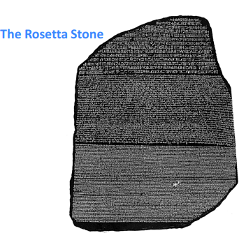
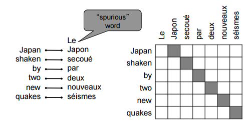
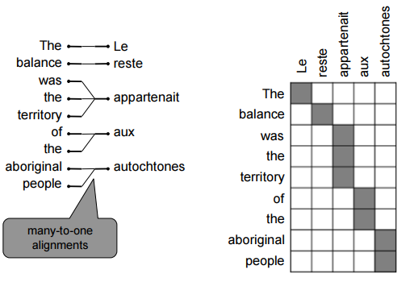
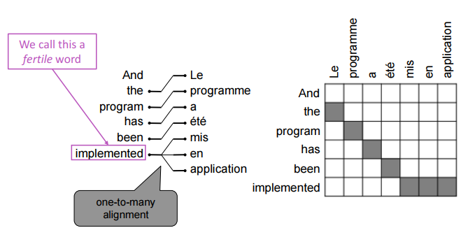
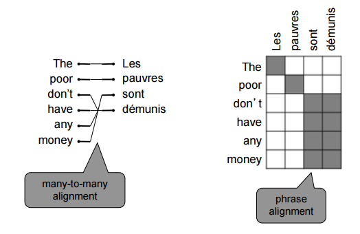
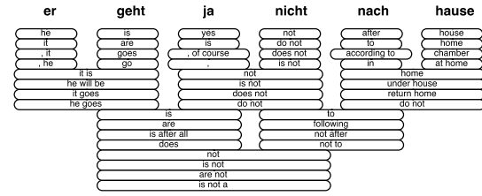
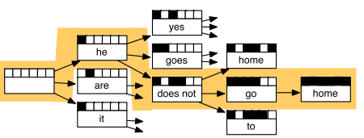
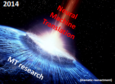
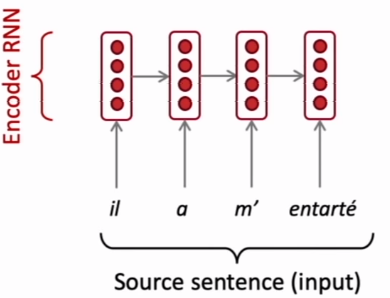
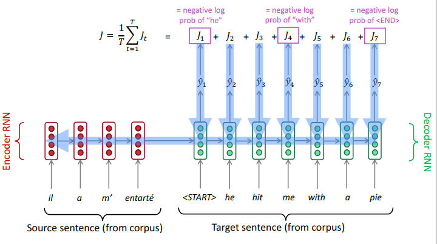

# 【2019斯坦福CS224N笔记】（8）Translation, Seq2Seq, Attention

机器翻译相信大家都不陌生，我们日常生活中经常会用到诸如百度翻译、谷歌翻译、有道翻译等等。这里我们给机器翻译下一个简单的定义：机器翻译(MT)是把一个句子x从一种语言(源语言)翻译成另一种语言(目标语言)的句子y。早期的机器翻译系统主要基于规则，使用双语词典将源语言映射到对应的目标语言。而现今，神经机器翻译已经逐渐走进历史舞台。

## 一、统计机器翻译

1990s-2010s，人们主要使用的是统计机器翻译。其核心思想是：从数据中学习概率模型。假设我们想把法语翻译为英语，即给定法语句子x，寻找最佳的英语句子y。我们可以用下图来描述：

然后，我们可以使用贝叶斯来把上式分解成两个部分，如下图所示：

其中，P(x|y):可以视为翻译模型。模型从并行数据中学习，单词或句子应该如何被翻译。P(y)：可以被视为语言模型。在本例子中，从英语数据中学习如何写好英语(流利)。之前的学习中，我们已经介绍过语言模型，这里不再赘述。因此，如何得到翻译模型P(x|y)是重点。下面我们分步来介绍传统的机器翻译是怎样实现的：

第一：我们需要一个大的平行语料库据（例如：翻译成法语/英语的句子对)。下图是世界上第一个平行语料库：罗塞塔石碑：

第二：对齐（翻译句子中特定词语之间的对应关系）。即法语句子x与英语句子y之间的单词级对应。对齐时，原文中可能有部分词语没有对应的译文，如下图所示：

对齐可以是多对一的，如下图所示：

对齐可以是一对多的，如下图所示：

当然，对齐可以是多对多(短语级)，如下图所示：

对齐之后，原文中每个单词都有多个备选单词，导致了许多短语的组合方式，如下图所示：

第三：解码，即使用heuristic search算法搜索最佳翻译，丢弃概率过低的假设，如下图所示：

以上所述，这还只是传统机器翻译系统的冰山一角，有许多细节没有涉及到，还需要大量的特征工程和人力维护，总之是非常复杂的系统。其中每个环节都是独立不同的机器学习问题。

而深度学习则提供了一个统一的模型，一个统一的最终目标函数。在优化目标函数的过程中，得到一个end to end的完整的joint模型。传统机器翻译系统与深度学习是截然相反的，对齐模型、词序模型、语言模型……一堆独立的模型无法联合训练。接下来我们来介绍神经机器翻译模型。

## 二、神经机器翻译——seq2seq

2014年，Neural Mechine Translation出现了。神经机器翻译(NMT)是一种使用单一神经网络进行翻译的机器翻译方法。神经网络结构称为sequence-to-sequence(又名seq2seq)。举个例子，我们的翻译任务定义为：

输入：一个法语句子（Source sentence）：il a m’ entarté。

输出：一个英语句子：he hit me with a pie。

Encoder负责将输入的原文本编码成一个向量（context），该向量是原文本的一个表征，包含了文本背景。为解码器提供初始隐藏状态。如下图所示：

Decoder是一种以编码为条件生成目标句的语言模型，即使用Encoder的最终状态和作为Decoder的初始隐状态。除此之外，Decoder的隐藏层还来源于前一个时刻的隐藏层和前一个预测结果。如下图所示，这是在测试时的Decoder，下文会介绍如何训练：

注意:这里的Encoder和Decoder，可以是普通的RNN，也可以是LSTM、GRU或者是Bi-LSTM等等，当然也可以是CNN。层数也可以是多层的。当然，我们不仅可以用同一种神经网络实现编码器和解码器，也可以用不同的网络，如编码器基于CNN，解码器基于RNN。

那么，我们如何训练一个NMT系统呢？和传统的机器翻译系统一样，首先我们需要一个大的平行语料库，然后我们对Source sentence进行编码，然后使用Encoder的最终隐藏状态作为Decoder的初始隐藏状态进行预测y1，y2……y7，然后用Decoder中输入的Target sentence和预测出来的y计算loss（例如交叉熵损失函数），最后使用反向传播来更新模型中的参数。如下图所示：

上文中，在Decoder里我们通过argmax来一步步生成单词，这种方式我们称之为贪婪解码。但是，这使得在生成前面的单词后无法回溯。那么我们如何解决这个问题呢？不难想到，我们可以计算所有可能的情况，但很明显这样的计算代价是非常大的。因此，我们采用来一种新的方式——Beam search decoding。

Beam search decoding的核心思想是：在解码器的每个步骤中，跟踪k个最可能的部分(我们称之为假设)，其中k我们称之为beam size（大约是5到10）。Beam search虽然不能保证我们找到最优解，但比穷举搜索更有效。通常我们在进行t次个词后可以停止Beam search。最后我们需要在计算总得分后除以t，如下图所示：

经过上文，我们很容易理解所谓的seq2seq，它其实是一个Encoder和一个Decoder，Encoder用来编码source sentence，Decoder使用Encoder的最终隐藏状态作为其的初始隐藏状态，充当为一个语言模型来预测单词，然后根据Target sentence计算loss来更新模型。

那么，我们可以单独训练Encoder和Decoder吗？答案是可以的，但是同步训练的好处是，我们可以同时优化模型中的参数。当然，如果我们分开训练，也可以使用一个预训练好的语言模型作为Decoder的初始状态，然后针对你的任务进行fine tune。此外，对于模型中需要的word embeding，我们可以使用该任务的语料库得到，也可以使用现成的word embeding，然后进行fine tune。

## 三、NMT vs SMT

与SMT相比，NMT有很多优点:

- 更好的性能：更流利、更好地利用上下文、更好地使用短语相似性
- 单个神经网络端到端优化：没有需要单独优化的子组件
- 需要更少的人力工作：没有特征工程、所有语言对的方法相同

当然，也有一些缺点：

与SMT基于规则的方式相比，NMT的可解释性较差：难以调试。例如：当我们使用NMT模型进行翻译时，如果发现翻译错误，我们很难找到是模型中的哪个神经元或者参数出了问题。

## 四、如何评估机器翻译模型

BLEU（Bilingual Evaluation Understudy）是一个人们普遍运用的MT模型评价标注。BLEU将机器翻译与一个或多个人工翻译进行比较，并根据以下条件计算相似度评分:

- n-gram精度(通常为1、2、3和4-grams)
- 此外，系统翻译太短也会受到惩罚

虽然BLEU很有用，但也有一些缺点。例如：一个句子可以有很多种翻译方式，因此一个好的翻译可能会得到一个较差的BLEU评分，因为它与人工翻译的n-grams重叠度较低。但是作为自动评价机器翻译系统好坏的方法，我们仍不得不暂时使用BLEU作为机器翻译系统的评价标准。

## 五、注意力机制

### 1.动机

上文中，我们提到的seq2seq模型中，很重要的一个步骤是，把Encoder的最终隐藏状态当作Decoder的初始隐藏状态的一部分，这样做造成源语句的编码必须捕获关于源语句的所有信息，才可以使模型很好的工作。但事实上，这样仅仅依靠这一个状态来进行后面的解码过程是很不可靠的，因此注意力机制的提出就可以很好的解决这个瓶颈。

注意力机制的核心思想是：在解码器的每个步骤上，使用与编码器的直接连接来注意源序列的特定部分。简单来说，注意力机制为解码器网络提供了在每个解码步骤查看整个输入序列的功能，然后解码器可以在任何时间点决定哪些输入单词是重要的。接下来我们通过公式来从本质上理解一下Attention机制。

### 2.公式理解

首先，我们来做一下定义：编码器的隐藏状态为: h_1,……,h_N。在时间步t，解码器的隐藏状态为：s_t。

接下来，我们可以得到t时间步下的attention分数e^t,并使用softmax函数进行归一化处理得到α^t，如下图所示：

然后，我们用α^t个编码器隐藏层状态进行加权求和，得到attention的输出a_t（有时也称之为context vector），如下图所示：

最后，我们将注意输出与解码器隐藏状态连接起来，并按照非注意seq2seq模型进行处理，如下图所示：

以上就是一般情况下attention机制的公式描述，接下来我们给出更加广义的attention定义：给定一组向量值和一个向量查询，注意力机制是一种根据查询计算值的加权和的技术。因此有时，我们也简单称之为查询处理值。例如，在seq2seq + attention模型中，每个解码器隐藏状态(查询)都关注所有编码器隐藏状态(值)。因此注意力机制中的加权和是值中包含的信息的选择性汇总，查询在其中确定要关注哪些值。

这里我们介绍一下attention机制的几种常见形式：假设我们拥有一些值h_1,……,h_N，维度为d_1和一个查询s，维度为d_2，且d_1 = d_2，则：

- Basic dot-product attention(和上文介绍的attention一致)：

    

- Multiplicative attention：这里的W是一个维度为d_2 * d_1的权重矩阵，也是我们需要更新的参数之一

    

- Additive attention：这里的W_1的维度是d_3 *d_1，W_2的维度是d_3 *d_2，v是一个维度为d_3的权重向量，d_3也是模型中的一个超参数

    

## 小结

本节课我们首先回顾了传统的统计机器翻译（SMT），接着讲述了神经机器翻译（NMT）——seq2seq，最后利用Attention机制seq2seq模型进行了改进。当然，此时的seq2seq模型仍存在一些缺点，比如OOV（Out-of-Vocabulary）问题，可以通过指针或者复制机制来处理，又比如大规模输出词汇处理的问题、训练和测试数据之间的域不匹配（例如：训练数据采用正式的文本，而测试数据采用聊天的非正式文本）等等，有兴趣的朋友可以查阅相关资料。

喜欢的童鞋记得分享给别的小伙伴哈。AIMI-CN AI学习交流群【1015286623】 获取更多AI资料扫码加群：

分享技术，乐享生活：我们的公众号每周推送“AI”系列资讯类文章，欢迎您的关注！

